## 一. 报错总结

### 1.运行`hadoop fs -put /home/hduser/Desktop/test.txt /input`报错.

- **造成有个问题的原因最常见的是多次 `hadoop namenode -format`格式化`namenode`造成的，即 `namespaceID` 不一致。**

#### 1）查看

```shell
[root@master hduser]# hadoop fs -put /home/hduser/Desktop/test.txt /input
2019-09-01 09:44:29,336 WARN hdfs.DataStreamer: DataStreamer Exception
org.apache.hadoop.ipc.RemoteException(java.io.IOException): File /input/test.txt._COPYING_ could only be written to 0 of the 1 minReplication nodes. There are 0 datanode(s) running and 0 node(s) are excluded in this operation.
        at org.apache.hadoop.hdfs.server.blockmanagement.BlockManager.chooseTarget4NewBlock(BlockManager.java:2121)
        at org.apache.hadoop.hdfs.server.namenode.FSDirWriteFileOp.chooseTargetForNewBlock(FSDirWriteFileOp.java:295)
        at org.apache.hadoop.hdfs.server.namenode.FSNamesystem.getAdditionalBlock(FSNamesystem.java:2702)
        at org.apache.hadoop.hdfs.server.namenode.NameNodeRpcServer.addBlock(NameNodeRpcServer.java:875)
        at org.apache.hadoop.hdfs.protocolPB.ClientNamenodeProtocolServerSideTranslatorPB.addBlock(ClientNamenodeProtocolServerSideTranslatorPB.java:561)
        at org.apache.hadoop.hdfs.protocol.proto.ClientNamenodeProtocolProtos$ClientNamenodeProtocol$2.callBlockingMethod(ClientNamenodeProtocolProtos.java)
        at org.apache.hadoop.ipc.ProtobufRpcEngine$Server$ProtoBufRpcInvoker.call(ProtobufRpcEngine.java:523)
        at org.apache.hadoop.ipc.RPC$Server.call(RPC.java:991)
        at org.apache.hadoop.ipc.Server$RpcCall.run(Server.java:872)
        at org.apache.hadoop.ipc.Server$RpcCall.run(Server.java:818)
        at java.security.AccessController.doPrivileged(Native Method)
        at javax.security.auth.Subject.doAs(Subject.java:422)
        at org.apache.hadoop.security.UserGroupInformation.doAs(UserGroupInformation.java:1729)
        at org.apache.hadoop.ipc.Server$Handler.run(Server.java:2678)

        at org.apache.hadoop.ipc.Client.getRpcResponse(Client.java:1511)
        at org.apache.hadoop.ipc.Client.call(Client.java:1457)
        at org.apache.hadoop.ipc.Client.call(Client.java:1367)
        at org.apache.hadoop.ipc.ProtobufRpcEngine$Invoker.invoke(ProtobufRpcEngine.java:228)
        at org.apache.hadoop.ipc.ProtobufRpcEngine$Invoker.invoke(ProtobufRpcEngine.java:116)
        at com.sun.proxy.$Proxy9.addBlock(Unknown Source)
        at org.apache.hadoop.hdfs.protocolPB.ClientNamenodeProtocolTranslatorPB.addBlock(ClientNamenodeProtocolTranslatorPB.java:510)
        at sun.reflect.NativeMethodAccessorImpl.invoke0(Native Method)
        at sun.reflect.NativeMethodAccessorImpl.invoke(NativeMethodAccessorImpl.java:62)
        at sun.reflect.DelegatingMethodAccessorImpl.invoke(DelegatingMethodAccessorImpl.java:43)
        at java.lang.reflect.Method.invoke(Method.java:498)
        at org.apache.hadoop.io.retry.RetryInvocationHandler.invokeMethod(RetryInvocationHandler.java:422)
        at org.apache.hadoop.io.retry.RetryInvocationHandler$Call.invokeMethod(RetryInvocationHandler.java:165)
        at org.apache.hadoop.io.retry.RetryInvocationHandler$Call.invoke(RetryInvocationHandler.java:157)
        at org.apache.hadoop.io.retry.RetryInvocationHandler$Call.invokeOnce(RetryInvocationHandler.java:95)
        at org.apache.hadoop.io.retry.RetryInvocationHandler.invoke(RetryInvocationHandler.java:359)
        at com.sun.proxy.$Proxy10.addBlock(Unknown Source)
        at org.apache.hadoop.hdfs.DFSOutputStream.addBlock(DFSOutputStream.java:1081)
        at org.apache.hadoop.hdfs.DataStreamer.locateFollowingBlock(DataStreamer.java:1866)
        at org.apache.hadoop.hdfs.DataStreamer.nextBlockOutputStream(DataStreamer.java:1668)
        at org.apache.hadoop.hdfs.DataStreamer.run(DataStreamer.java:716)
put: File /input/test.txt._COPYING_ could only be written to 0 of the 1 minReplication nodes. There are 0 datanode(s) running and 0 node(s) are excluded in this operation.


```

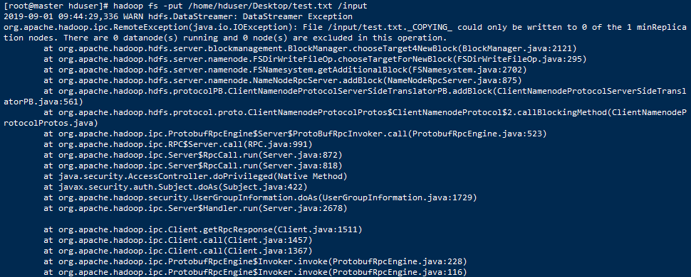


#### 2）使用`hadoop dfsadmin -report`命令查看磁盘使用情况，发现出现以下问题

```shell
[root@master hduser]# hadoop dfsadmin -report
WARNING: Use of this script to execute dfsadmin is deprecated.
WARNING: Attempting to execute replacement "hdfs dfsadmin" instead.

Configured Capacity: 0 (0 B)
Present Capacity: 0 (0 B)
DFS Remaining: 0 (0 B)
DFS Used: 0 (0 B)
DFS Used%: 0.00%
Replicated Blocks:
        Under replicated blocks: 0
        Blocks with corrupt replicas: 0
        Missing blocks: 0
        Missing blocks (with replication factor 1): 0
        Low redundancy blocks with highest priority to recover: 0
        Pending deletion blocks: 0
Erasure Coded Block Groups: 
        Low redundancy block groups: 0
        Block groups with corrupt internal blocks: 0
        Missing block groups: 0
        Low redundancy blocks with highest priority to recover: 0
        Pending deletion blocks: 0

-------------------------------------------------
```

- **造成有个问题的原因最常见的是多次 `hadoop namenode -format`格式化`namenode`造成的，即 `namespaceID` 不一致。**
   这种情况清空logs，重启启动有时候甚至有时候都没有`datanode`的日志产生。

#### 第一种解决方法

- 找到不一致的 `VERSION` 修改  `namespaceID`

- 查看`namenode`和`datanode`的文件夹在哪里，从`hdfs-site.xml`可以查看到

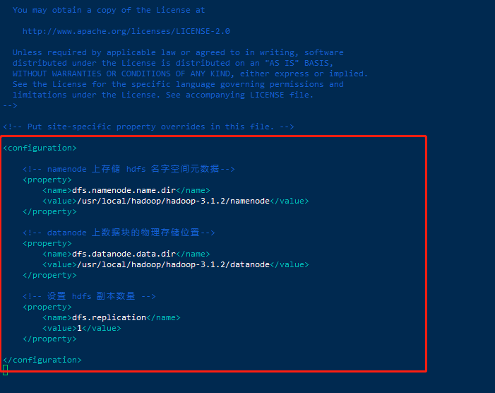

- 进入文件夹，找到一个叫做VERSION的文件

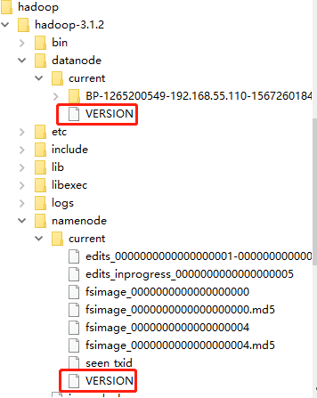

- 查找到`datenode`和`namenode`文件夹中的`VERSION`中`clusterID`字段，修改一致。

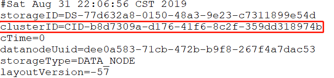

- 如果产生了数据，还需要保证data中VERSION一致。在`hdfs`中配置的data目录（即在`core-site.xml`中配置的`hadoop.tmp.dir`对应文件件）下面的`VERSION`中`clusterID`也需要对应。

  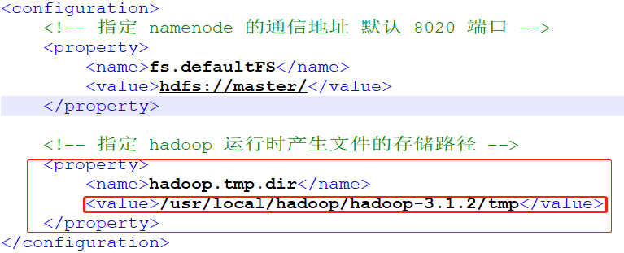

- 查找到文件中的这个`clusterID`字段，修改与上面一致。

  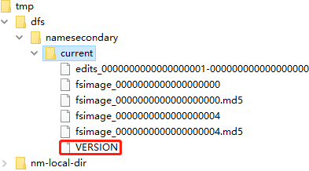

- 需要保证当前正在使用的`namenode`、`datanode`、`tmp`中VERSION中的`clusterID`是相同的。这样集群跑起来就是正常的了。

  ```shell
  [root@master hduser]# start-all.sh
  Starting namenodes on [master]
  Last login: Sun Sep  1 15:15:40 CST 2019 on pts/0
  Starting datanodes
  Last login: Sun Sep  1 15:19:07 CST 2019 on pts/0
  Starting secondary namenodes [master]
  Last login: Sun Sep  1 15:19:10 CST 2019 on pts/0
  Starting resourcemanager
  Last login: Sun Sep  1 15:19:20 CST 2019 on pts/0
  Starting nodemanagers
  Last login: Sun Sep  1 15:19:32 CST 2019 on pts/0
  [root@master hduser]# jps
  25696 Jps
  23911 NameNode
  24455 SecondaryNameNode
  24951 ResourceManager
  [root@master hduser]# hadoop dfsadmin -report
  WARNING: Use of this script to execute dfsadmin is deprecated.
  WARNING: Attempting to execute replacement "hdfs dfsadmin" instead.
  
  Safe mode is ON
  Configured Capacity: 160982630400 (149.93 GB)
  Present Capacity: 144526098432 (134.60 GB)
  DFS Remaining: 144526061568 (134.60 GB)
  DFS Used: 36864 (36 KB)
  DFS Used%: 0.00%
  Replicated Blocks:
          Under replicated blocks: 0
          Blocks with corrupt replicas: 0
          Missing blocks: 0
          Missing blocks (with replication factor 1): 0
          Low redundancy blocks with highest priority to recover: 0
          Pending deletion blocks: 0
  Erasure Coded Block Groups: 
          Low redundancy block groups: 0
          Block groups with corrupt internal blocks: 0
          Missing block groups: 0
          Low redundancy blocks with highest priority to recover: 0
          Pending deletion blocks: 0
  
  -------------------------------------------------
  Live datanodes (3):
  
  Name: 192.168.55.111:9866 (slave1)
  Hostname: slave1
  Decommission Status : Normal
  Configured Capacity: 53660876800 (49.98 GB)
  DFS Used: 12288 (12 KB)
  Non DFS Used: 5541580800 (5.16 GB)
  DFS Remaining: 48119283712 (44.81 GB)
  DFS Used%: 0.00%
  DFS Remaining%: 89.67%
  Configured Cache Capacity: 0 (0 B)
  Cache Used: 0 (0 B)
  Cache Remaining: 0 (0 B)
  Cache Used%: 100.00%
  Cache Remaining%: 0.00%
  Xceivers: 1
  Last contact: Sun Sep 01 15:20:59 CST 2019
  Last Block Report: Sun Sep 01 15:20:00 CST 2019
  Num of Blocks: 0
  
  
  Name: 192.168.55.112:9866 (slave2)
  Hostname: slave2
  Decommission Status : Normal
  Configured Capacity: 53660876800 (49.98 GB)
  DFS Used: 12288 (12 KB)
  Non DFS Used: 5377015808 (5.01 GB)
  DFS Remaining: 48283848704 (44.97 GB)
  DFS Used%: 0.00%
  DFS Remaining%: 89.98%
  Configured Cache Capacity: 0 (0 B)
  Cache Used: 0 (0 B)
  Cache Remaining: 0 (0 B)
  Cache Used%: 100.00%
  Cache Remaining%: 0.00%
  Xceivers: 1
  Last contact: Sun Sep 01 15:20:57 CST 2019
  Last Block Report: Sun Sep 01 15:20:42 CST 2019
  Num of Blocks: 0
  
  
  Name: 192.168.55.113:9866 (slave3)
  Hostname: slave3
  Decommission Status : Normal
  Configured Capacity: 53660876800 (49.98 GB)
  DFS Used: 12288 (12 KB)
  Non DFS Used: 5537935360 (5.16 GB)
  DFS Remaining: 48122929152 (44.82 GB)
  DFS Used%: 0.00%
  DFS Remaining%: 89.68%
  Configured Cache Capacity: 0 (0 B)
  Cache Used: 0 (0 B)
  Cache Remaining: 0 (0 B)
  Cache Used%: 100.00%
  Cache Remaining%: 0.00%
  Xceivers: 1
  Last contact: Sun Sep 01 15:20:59 CST 2019
  Last Block Report: Sun Sep 01 15:20:41 CST 2019
  Num of Blocks: 0
  
  ```

  

#### 第二种解决方案

- 删除 `hdfs/data` 中全部文件，重新初始化`namenode`，这样做数据就全部没了（看到的结果是这样）

- 1、停止集群

  ```shell
  [root@master hduser]# stop-all.sh
  ```

- 2、删除在`hdfs`中配置的data目录（即在`core-site.xml`中配置的`hadoop.tmp.dir`对应文件件）下面的所有数据。

- 

- 4、删除

  ```shell
  [root@master hduser]# rm -rf /usr/local/hadoop/hadoop-3.1.2/tmp/*
  ```

- 5、重新格式化`namenode`

  ```shell
  [root@master hduser]# hdfs namenode -format
  ```

- 5、重新启动集群

  ```shell
  [root@master hduser]# start-all.sh
  ```

- 补充一点

  - **`hdfs namenode -format`只需要在Master节点执行一次！！！**

  - 如果不小心在slave1、slave2、slave3执行了`hdfs namenode -format`，可以删除多余的文件夹及文件（一般会多余一个`namenode`文件夹即tmp目录下多个dfs文件夹）。下面使slave节点的目录。

    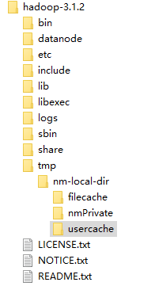


参考：

https://blog.csdn.net/wild46cat/article/details/53424049

https://blog.csdn.net/weiyongle1996/article/details/74094989


### 2.Web访问不了50070端口 

- 是否安装vpn了，按的话，关闭
- 是否开防火墙，关闭

1、查看50070端口是否已经开了

```shell
[root@master hduser]# netstat -ntlp

#或者这个命令
[root@master hduser]# netstat -ant
```

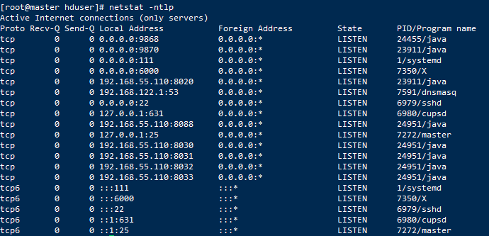

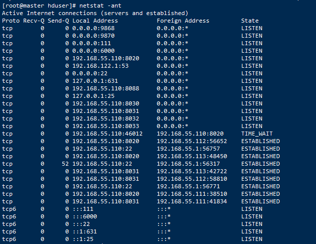

- 没有50070端口号

2、修改`hadoop-3.1.2/etc/hadoop/hdfs-site.xml`文件，我的是在`/usr/local/hadoop/hadoop-3.1.2/etc/hadoop/hdfs-site.xml`，在最后加入。

```properties
<!-- 设置访问端口号 -->
<property>
<name>dfs.http.address</name>
<value>0.0.0.0:50070</value>
</property>
```

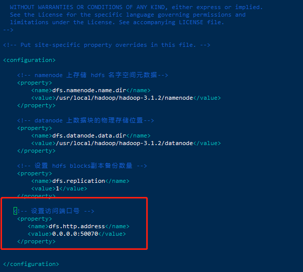

3、先关闭集群，再重启即可。

```shell
[root@master hduser]# stop-all.sh

[root@master hduser]# start-all.sh
```

4、再次查看50070端口是否已经开了

```shell
[root@master hduser]# netstat -ant 

#或者下面这个命令
[root@master hduser]# netstat -ntlp

```

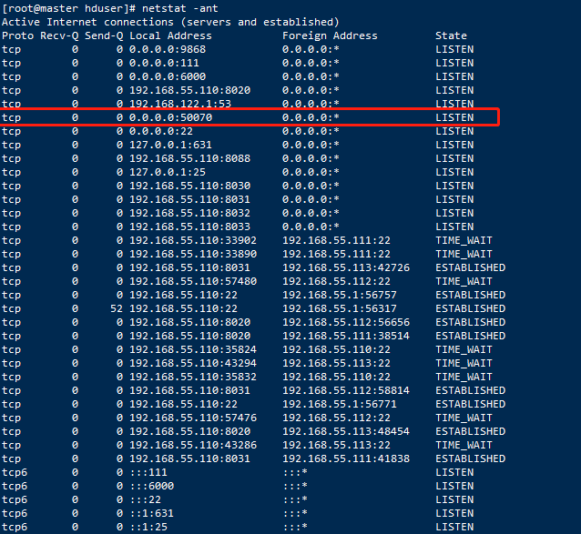

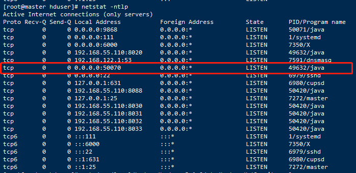

5、浏览器访问

[http://192.168.55.110:50070](http://192.168.55.110:50070/)

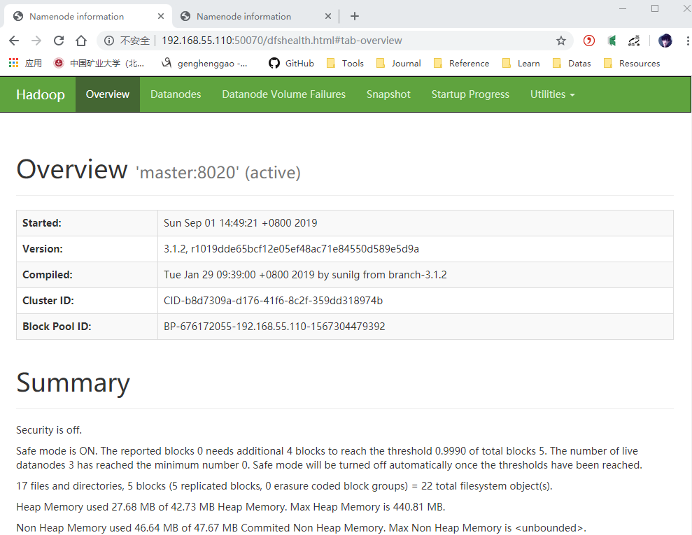


参考：

https://blog.csdn.net/lidew521/article/details/87901849