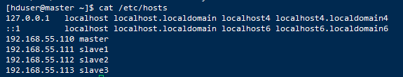

[TOC]


## 1. 配置 hosts、hostname

- 配置规划
  - 192.168.55.110 master
  - 192.168.55.111 slave1
  - 192.168.55.112 slave2
  - 192.168.55.113 slave3

1、四 台主机的 hosts 配置文件如下

```shell
[hduser@master ~]$ cat /etc/hosts
127.0.0.1   localhost localhost.localdomain localhost4 localhost4.localdomain4
::1         localhost localhost.localdomain localhost6 localhost6.localdomain6
192.168.55.110 master
192.168.55.111 slave1
192.168.55.112 slave2
192.168.55.113 slave3
```



2、master 的 hostname，同样在另外三台机器查询。

```shell
[hduser@master ~]$ cat /etc/hostname
master
```


## 2、配置SSH


## 3、配置JDK

### 

## 4、关闭防火墙


## 5、下载、解压 Hadoop

5.1、下载 [Hadoop 3.1.2](https://www.apache.org/dyn/closer.cgi/hadoop/common/hadoop-3.1.2/hadoop-3.1.2-src.tar.gz) 版本

5.1 创建 hadoop 目录