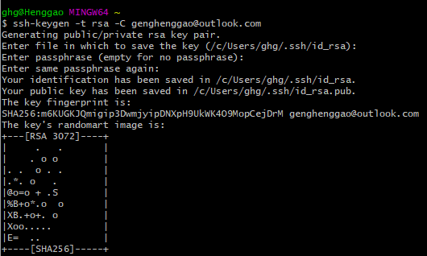
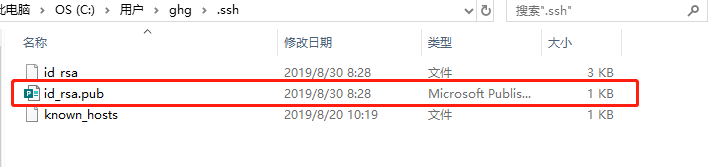
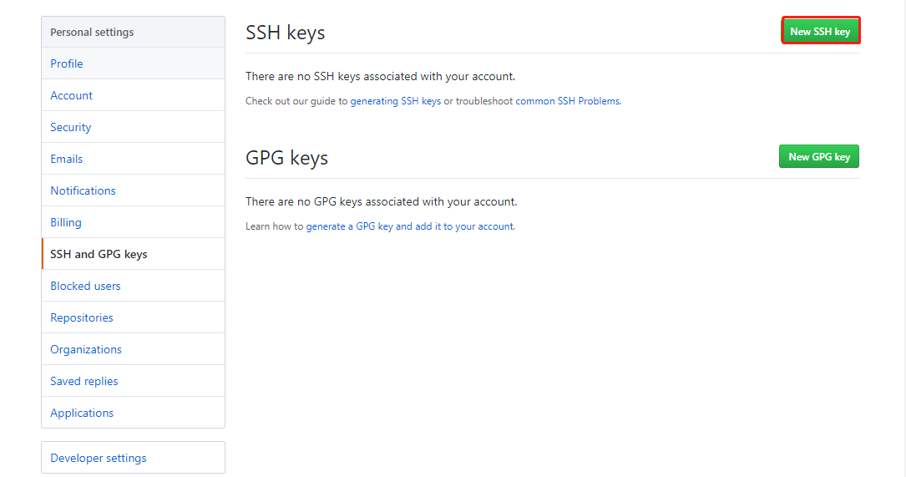
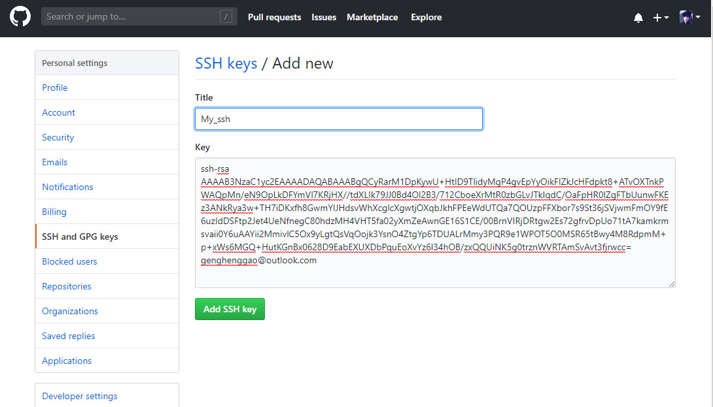
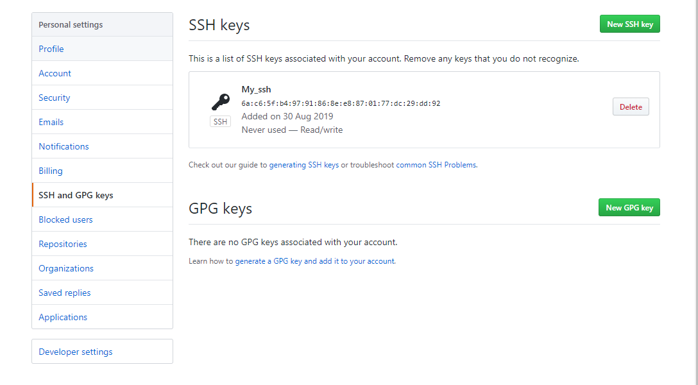
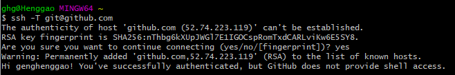

## 一、Git上传到GitHub

1、安装好Git，打开Git Bash

2、查看是否存在密钥ssh keys（这里没有keys）

```
ll ~/.ssh
```


3、创建新的ssh keys，输入`ssh-keygen -t rsa -C genghenggao@outlook.com`，一路回车。

```shell
ssh-keygen -t rsa -C genghenggao@outlook.com
```



从上面配置发现keys存放在`/c/Users/ghg/.ssh/id_rsa.pub.



4、浏览器进入自己的github，打开Settings


5、进入ssh and GPG keys，然后再点击右上角添加新密钥按钮New SSH key



6、将idb_rsa.pub里的内容拷贝到Key内，Title内容随便填，确定即可。



7、提示输入GitHub密码，返回页面。



8、用`ssh -T git@github.com`测试自己是否可以连接成功了，中间有个输入需要输入yes，后面可以看到`Hi genghenggao! You've successfully authenticated, but GitHub does not provide shell access.`表示成功。

```
ssh -T git@github.com
```



9、


参考：

https://www.cnblogs.com/superjt/p/5977719.html

https://www.cnblogs.com/sdcs/p/8270029.html