# Vmware中CentOS

[TOC]


## 一、安装CentOS7.6


## 二、设置网络NAT

1、针对Windows宿主机防火墙（可以关闭，我这里是打开的），windows下CMD中ipconfig命令查看。

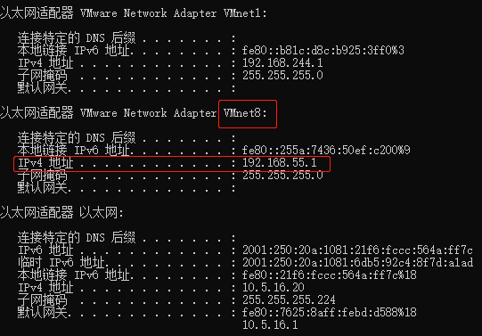


DNS设置，在目录

```shell
vi /etc/resolv.conf 
nameserver 8.8.8.8
nameserver 8.8.4.4
```

参考：

https://blog.csdn.net/llluluyi/article/details/79041791


## 三、CentOS时间设置

1、安装ntp服务软件包：

```shell
yum install ntp
```

2、将ntp设置为缺省启动：

```shell
systemctl enable ntpd
```

3、修改启动参数，增加-g -x参数，允许ntp服务在系统时间误差较大时也能正常工作：

```
vi /etc/sysconfig/ntpd
```

4、启动ntp服务：

```
service ntpd restart
```

5、将系统时区改为上海时间（即CST时区）：

```
ln -sf /usr/share/zoneinfo/Asia/Shanghai /etc/localtime
```

6、输入date命令查看时间是否正确


启动自动同步时间

```shell
timedatectl set-ntp yes
```


## 四、克隆虚拟机

1、被克隆的虚拟机处于关闭状态

2、右击被克隆的虚拟机-->管理-->克隆

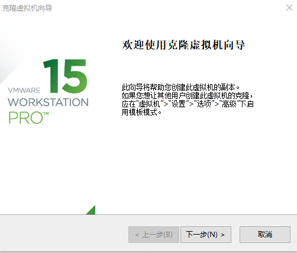

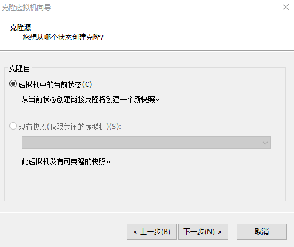

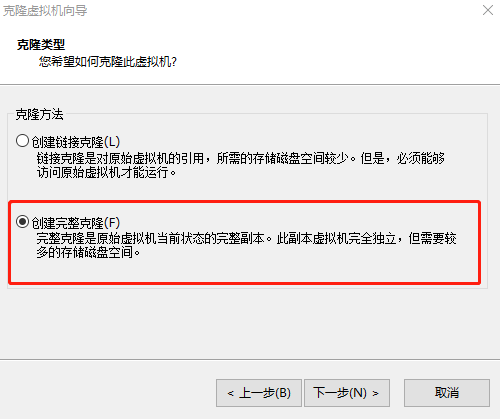

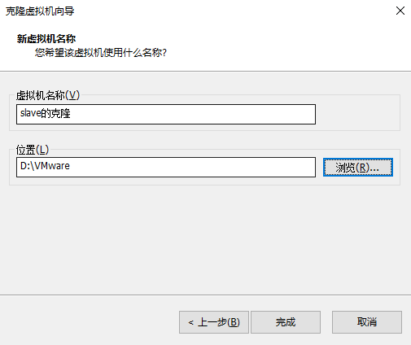


## 五、修改虚拟机配置

1、修改网卡配置（root权限）

```shell
vi /etc/sysconfig/network-scripts/ifcfg-ens33
```

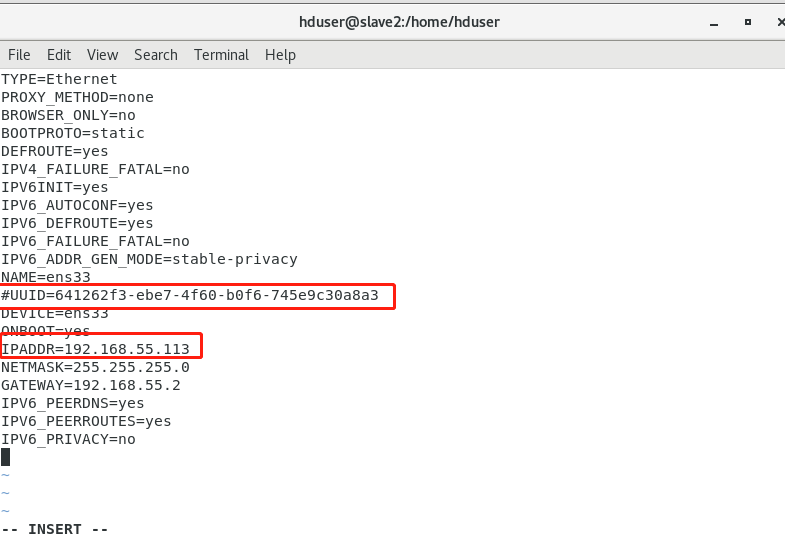

- 删除UUID信息

- 修改IPADDR信息为“172.25.10.112”

- 并保存退出。

2、修改完IPADDR后**再执行  service network restart**

```shell
service network restart
```

3、删除部分文件，查看。

```
ll /etc/udev/rules.d/
```

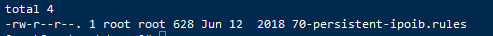

4、切换到目录，输入命令 “rm -rf 70-persistent-net.rules”删除文件

```
cd /etc/udev/rules.d

rm -rf 70-persistent-net.rules
```

5、关机，设置MAC地址

5.1、编辑虚拟机设置

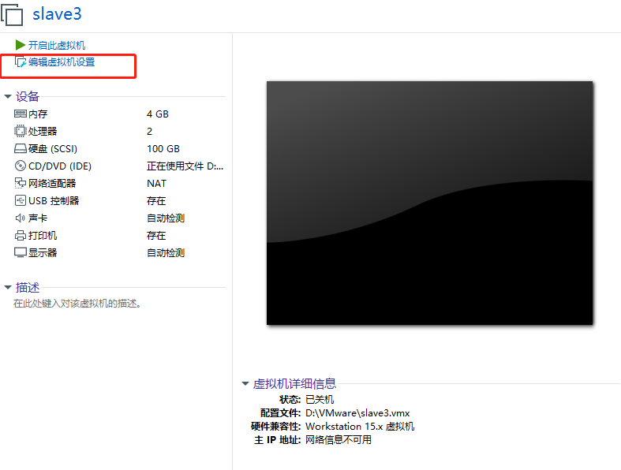

5.2、选择NAT模式，点击高级

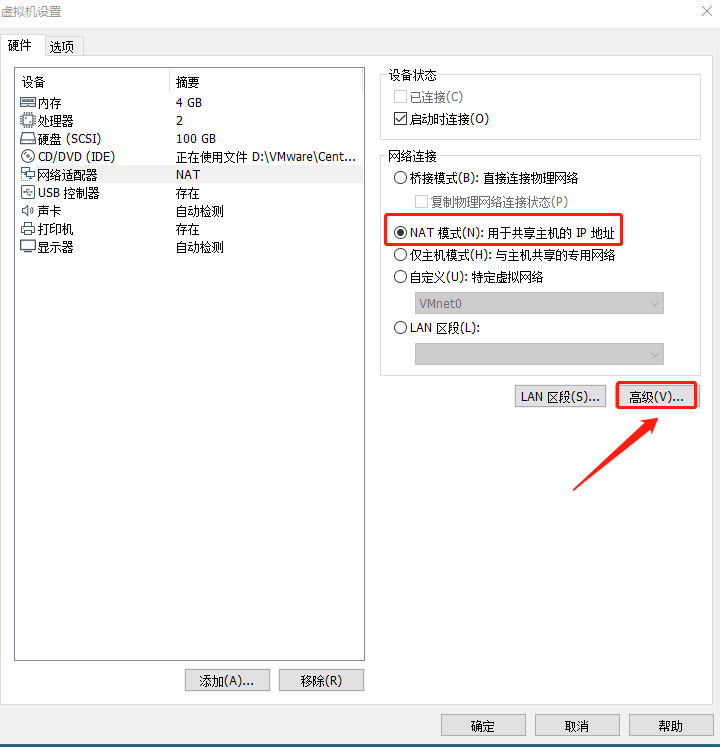

5.3、点击生成-->确定

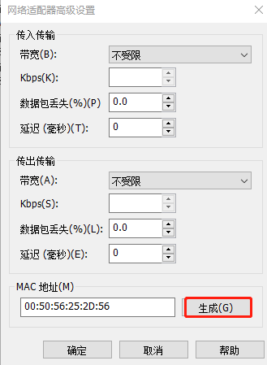


6、开机，测试互ping

```shell
#被复制机器上
ping 192.168.55.113

#复制的新机器上
ping 192.168.55.111
```

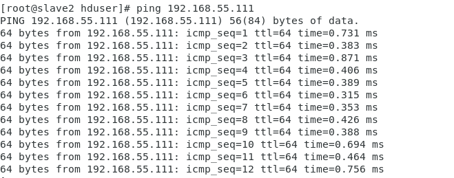

6、CentOS7修改hostname

```shell
[root@slave2 hduser]# hostnamectl set-hostname slave3
[root@slave2 hduser]# hostname 
slave3
[root@slave2 hduser]# vim /etc/hosts
[root@slave2 hduser]# cat /etc/hosts
```

- 给127.0.0.1添加hostname

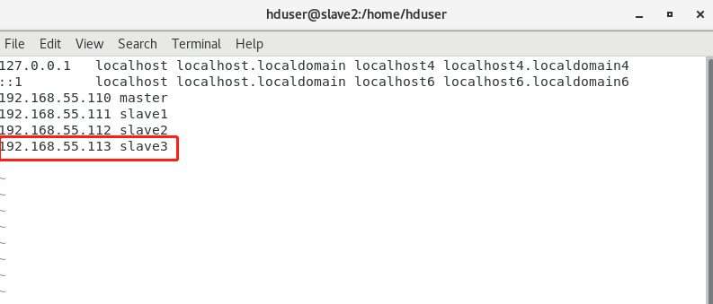


参考：

https://blog.csdn.net/mijichui2153/article/details/80918285


## 六、CentOS中Java环境配置

- Linux CentOS7.6自带jdk环境修改变量

1、查看

```shell
java -version
```

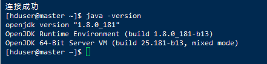

2、查看默认jdk的位置

```shell
 which java
```


3、继续追踪

```shell
ls -lrt /usr/bin/java
```


4、继续追踪

```shell
ls -lrt /etc/alternatives/java
```

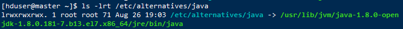

5、查看jdk，有俩个版本1.7、1.8

```shell
ll /usr/lib/jvm
```

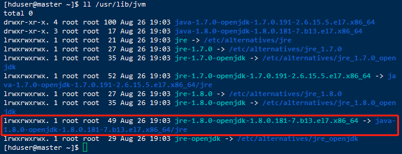

找到了初始的jdk1.7和jdk1.8位置（即系统当前jdk），而我们需要的jdk1.8版本的位置，即`jre-1.8.0-openjdk-1.8.0.181-7.b13.el7.x86_64`，记录下位置：

`/usr/lib/jvm/jre-1.8.0-openjdk-1.8.0.181-7.b13.el7.x86_64`

6、编辑环境变量（root权限）

```shell
vim /etc/profile
```

7、在文本最后添加

```shell
#java
export JAVA_HOME=/usr/lib/jvm/jre-1.8.0-openjdk-1.8.0.181-7.b13.el7.x86_64
export PATH=$PATH:$JAVA_HOME/bin
export CLASSPATH=.:$JAVA_HOME/lib/tools.jar:$JAVA_HOME/lib/dt.jar
```

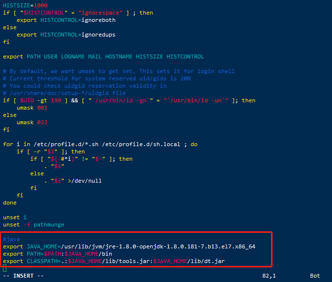

8、按esc输入:wq保存并退出

9、使环境变量生效

```shell
source /etc/profile 
```


参考：

https://www.cnblogs.com/zhenxiqia/p/9049290.html


## 七、CentOS7 配置免密码登录

- 4台主机（首先设置好映射`vim /etc/hosts`）
  - 192.168.55.110 master
  - 192.168.55.111 slave1
  - 192.168.55.112 slave2
  - 192.168.55.113 slave3

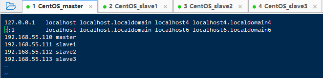

1、四台主机检查 ~/.ssh 文件夹（这里以master节点为例）

```shell
#查看~/.ssh 文件夹
ll ~/.ssh
```

2、没有 ~/.ssh 文件夹则新建。输入`ssh-keygen -t rsa`，一路回车。

```shell
#新建
ssh-keygen -t rsa
```

3、查看  ~/.ssh 目录，会发现它下面生成了两个 id_rsa  ， id_rsa.pub文件


4、在master上将公钥（id_rsa.pub）拷贝到其它节点，包括本机。

```shell
ssh-copy-id master

ssh-copy-id slave1

ssh-copy-id slave2

ssh-copy-id slave3
```

5、在四台机器重复上述步骤即可。


