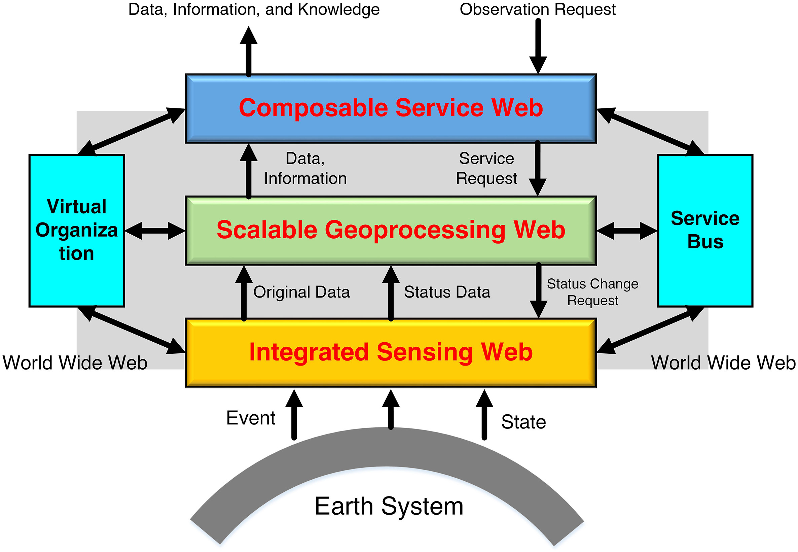
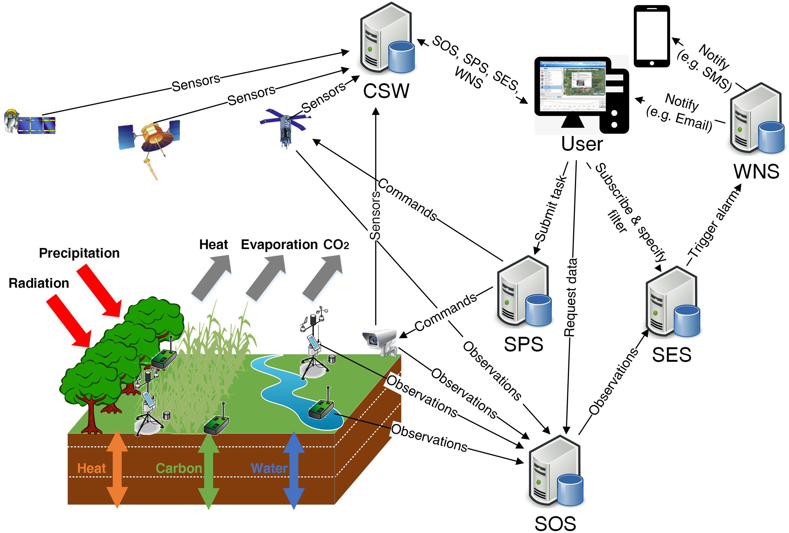
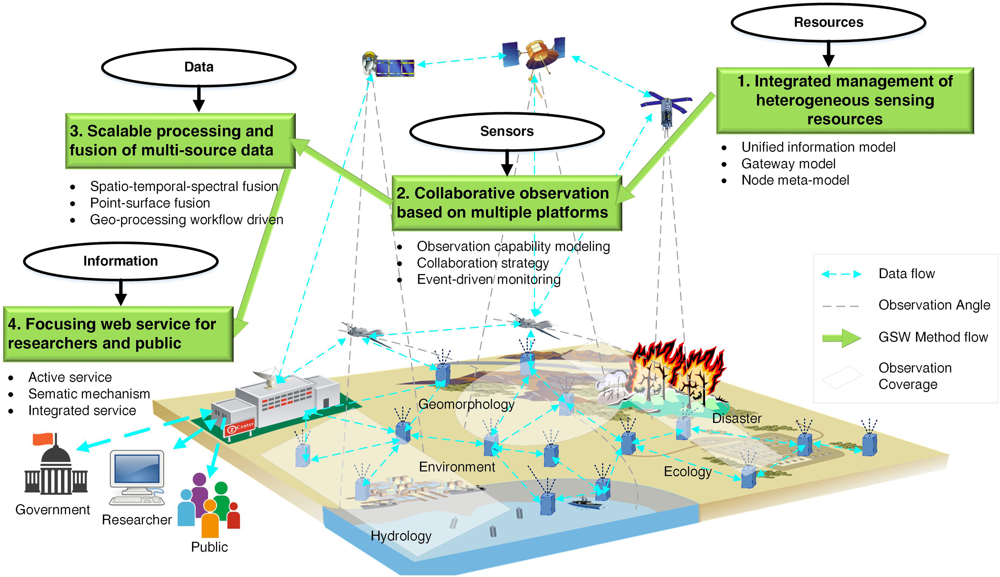

# 2019.10
[TOC]

## A framework for real time end to end monitoring and big data oriented management of smart environments

### 1、Highlights

- Monitoring of IoT device requires the analysis of big data.
- We propose a piece framework integrating AllJoyn with MongoDB and Storm.
- Different data patterns were designed to manage several smart home scenarios.
- Simulation experiments prove the feasibility of the proposed system.

### 2、Keywords

- Cloud computing

- Edge computing

- IoT

- Big data

- Monitoring

- Management

### 3、Transactions

- investigated 验证

- actuator 执行器

- smart  IoT Systems 智能物联网系统

- embedded devices 嵌入式设备
- threshold of energy 能量阈值
- energy consumption 能量消耗
- residence 住处
- In such a scenario 在这种情况下
- heterogeneous distributed systems 异构分布式系统
- storage/computing platforms 
- The [Internet of Things](https://www.sciencedirect.com/topics/engineering/internet-of-things) market is fragmented, amorphous, and continually changing 物联网市场是零散的，不固定的并且不断变化。

### 4、Quotations&Comments

MongoDB [[20\]](https://www.sciencedirect.com/science/article/pii/S0743731518308256?via%3Dihub#b20) is one of the major distributed document-oriented NoSQL databases, useful to store and efficiently manage Big Data originated by physical and composed measurements on the environment and on systems.

### 5、Methods

### 6、Technologies

- AllJoyn
- MongoDB
- Storm

### 7、Tasks

### 8、Overview

## [Geospatial sensor web: A cyber-physical infrastructure for geoscience research and application](https://www.sciencedirect.com/science/article/pii/S0012825217305044?via%3Dihub)

### 1、Highlights

### 2、Keywords

- Collaborative observation
- Focusing service
- Geoscience
- Geospatial
- Infrastructure
- Integrated management
- Scalable processing
- Sensor web

### 3、Transactions

- Geospatial Sensor Web 地理空间传感器网（GSW）

- Information and  Communication Technology 信息和通信技术（ICT）

- Open Geospatial Consortium 开放地理空间联盟（OGC）

- five sub-capabilities 五个子功能

- strike-slip faults	走滑断层 

- geoscience decisions	地球科学决策

- there is a need to develop effective interventions for removing or mitigating decision bias. 需要开发有效的干预措施来消除或减轻决策偏见。

- we discuss the cognitive mechanisms underlying decision biases and describe three biases that have been shown to influence geoscientists’ decision-making (availability bias, framing bias, anchoring bias).  我们讨论了决策偏见背后的认知机制，并描述了已证明会影响地球科学家的决策的三个偏见（可用性偏见，框架偏见，锚定偏见）。

- multidisciplinary technologies  多学科技术

- geoscience measurements, data processing, and information services 

- spatiotemporal  时空的

- interactions  相互作用

- This is a rebirth of old geoscience research that is now powered by state-of-the-art Information and Communication Technology (ICT). 这是旧的地球科学研究的重生，现在它由最新的信息和通信技术（ICT）提供支持。

- in-situ sample material  现场样品材料

- seismology 地震学

- hydrology  水文学

-  geomorphology 地貌学

- indispensable  必要的

- satellite remote sensing 卫星遥感

- The most vital component was the integration and display of all earth data 最重要的组成部分是所有地球数据的集成和显示

- overall 总而言之

- the most distinguishing feature 

-  pervasive sensor networks  普遍的传感器网络

-  revolutionize earth systems science  革新了地球系统科学

-  The subsequent GSW 随后的GSW

-  In this way, data integration can be decoupled from the analysis and visualization components, allowing for flexible and dynamic service chaining.  这样，可以将数据集成与分析和可视化组件分离，从而实现灵活而动态的服务链。

-   GSW is an advanced stage sensor web, which not only inherits the advantages of sensor webs but also possesses a greater capability for data processing and information services  GSW是一种先进的传感器网络，它不仅继承了传感器网络的优势，而且还具有更大的数据处理和信息服务能力

-  the emphasis of sensor webs 传感器网的重点

-   it acts as a “bridge” between geoscience observation/phenomenon and geoscience information/knowledge/decision-making. 它是地球科学观测/现象与地球科学信息/知识/决策制定之间的“桥梁”。

  

-  rich connotations 丰富的内涵

-  interoperable 可互操作的

-  This feature is quite different from an archival data based geoscience system. 此功能与基于档案数据的地球科学系统完全不同。

- optimizes the data flow 优化数据流

-  scalable processing and fusion of multi-source data 多源数据的可伸缩处理和融合

-  integrated management of heterogeneous sensing resources 异构传感资源的综合管理

-   syntax-level integration 语法级集成

-   semantic-level integration. 语义级别的集成。

-  Whereas  鉴于

-  obtain instant flood detection 获得即时洪水检测

-   on-demand retrieval 按需检索

-   a simulation/theoretical way  模拟/理论方法

-  simulation  名词：模拟，仿真，假装，仿拟

-  exploit  动词：利用，开发，剥削，开采，应用，勋绩

-  specifications 名词：规格，规范，格式

- feasibility 名词：可行性，可能性，或然性

-  geoscience disciplines 地球科学学科

-  Several emerging technologies could greatly facilitate the **convergence** of a model web, though each has limitations.  尽管每种新兴技术都有其局限性，但几种新兴技术可以极大地促进模型网络的**融合**。

  

### 4、Quotations&Comments

- live and historical sensor data 实时和历史传感器数据
- Geoscience big data has the following three features:
  - high dimensions
  - high complexity
  - high uncertainty
- [satellite remote sensing](https://www.sciencedirect.com/topics/earth-and-planetary-sciences/satellite-remote-sensing) first provides estimations for large areas, which is the most important evolutionary development in geoscience research ([Nash, 1988](https://www.sciencedirect.com/science/article/pii/S0012825217305044?via%3Dihub#bb0825)). 

### 5、Methods

- Three typical research paradigms in geoscience field

  - Experiment-based paradigm.	
  - Sensor-based paradigm.
  - GSW-based paradigm.

- Four key methods of GSW

  -  [integrated management](https://www.sciencedirect.com/topics/earth-and-planetary-sciences/integrated-management) of heterogeneous sensing resources, 

  - collaborative observation based on multiple platforms, 

  - scalable processing and fusion of multi-source data, 

  - focusing web services for researchers, government, and the public.

    
  
    
  
  

### 6、Technologies

- GSW first provides two technologies
  - a gateway model .
  -  a unified information model.

### 7、Tasks

### 8、Overview

# [A novel method for parallel indexing of real time geospatial big data generated by IoT devices](https://www.sciencedirect.com/science/article/pii/S0167739X18303637?via%3Dihub)

### 1、Highlights

### 2、Keywords

- IoT

- Zetta

- ADS-B

- R tree

- R+ tree

- R∗ tree

- MapReduce

- Apache spark

### 3、Transactions

-  in today’s scenario 在今天的情况下
-  the issues of parallel **bulk** loading of data 并行**批量**加载数据的问题
-  protocol  名词：协议，协定，礼仪，礼节，草约

### 4、Quotations&Comments

-  R Tree and its variants have emerged as most efficient, widely accepted and have adopted indexing method for the management and processing of geospatial data.  
-  Geospatial big data can be broadly classified into three types, **i.e.** raster data, vector data, and graph data [[34\]](https://www.sciencedirect.com/science/article/pii/S0167739X18303637?via%3Dihub#b34). 地理空间大数据可以大致分为三种类型，**即**栅格数据，矢量数据和图形数据

### 5、Methods

### 6、Technologies

### 7、Tasks

### 8、Overview

# [The Australian Geoscience Data Cube — Foundations and lessons learned](https://www.sciencedirect.com/science/article/pii/S0034425717301086?via%3Dihub)

### 1、Highlights

### 2、Keywords

### 3、Transactions

### 4、Quotations&Comments

### 5、Methods

### 6、Technologies

### 7、Tasks

### 8、Overview

# [Distributed Geoscience Algorithm Integration Based on OWS Specifications: A Case Study of the Extraction of a River Network](https://www.mdpi.com/2220-9964/8/1/12/htm)  

### 1、Highlights

### 2、Keywords

### 3、Transactions

### 4、Quotations&Comments

### 5、Methods

### 6、Technologies

### 7、Tasks

### 8、Overview