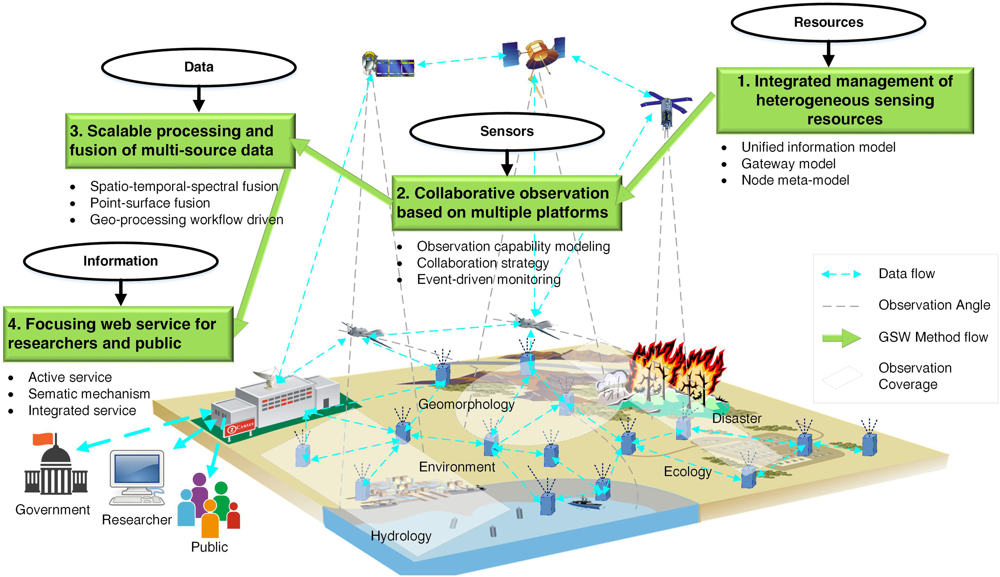

# 2019.10
[TOC]

## A framework for real time end to end monitoring and big data oriented management of smart environments

### 1、Highlights

- Monitoring of IoT device requires the analysis of big data.
- We propose a piece framework integrating AllJoyn with MongoDB and Storm.
- Different data patterns were designed to manage several smart home scenarios.
- Simulation experiments prove the feasibility of the proposed system.

### 2、Keywords

- Cloud computing

- Edge computing

- IoT

- Big data

- Monitoring

- Management

### 3、Transactions

- investigated 验证

- actuator 执行器

- smart  IoT Systems 智能物联网系统

- embedded devices 嵌入式设备
- threshold of energy 能量阈值
- energy consumption 能量消耗
- residence 住处
- In such a scenario 在这种情况下
- heterogeneous distributed systems 异构分布式系统
- storage/computing platforms 
- The [Internet of Things](https://www.sciencedirect.com/topics/engineering/internet-of-things) market is fragmented, amorphous, and continually changing 物联网市场是零散的，不固定的并且不断变化。

### 4、Quotations&Comments

MongoDB [[20\]](https://www.sciencedirect.com/science/article/pii/S0743731518308256?via%3Dihub#b20) is one of the major distributed document-oriented NoSQL databases, useful to store and efficiently manage Big Data originated by physical and composed measurements on the environment and on systems.

### 5、Methods

### 6、Technologies

- AllJoyn
- MongoDB
- Storm

### 7、Tasks

### 8、Overview

## Geospatial sensor web: A cyber-physical infrastructure for geoscience research and application

### 1、Highlights

### 2、Keywords

- Collaborative observation
- Focusing service
- Geoscience
- Geospatial
- Infrastructure
- Integrated management
- Scalable processing
- Sensor web

### 3、Transactions

- Geospatial Sensor Web 地理空间传感器网（GSW）
- Information and  Communication Technology 信息和通信技术（ICT）
- Open Geospatial Consortium 开放地理空间联盟（OGC）
- five sub-capabilities 五个子功能

### 4、Quotations&Comments

- live and historical sensor data 实时和历史传感器数据
- Geoscience big data has the following three features:
  - high dimensions
  - high complexity
  - high uncertainty

### 5、Methods

- Three typical research paradigms in geoscience field

  - Experiment-based paradigm.	
  - Sensor-based paradigm.
  - GSW-based paradigm.

- Four key methods of GSW

  -  [integrated management](https://www.sciencedirect.com/topics/earth-and-planetary-sciences/integrated-management) of heterogeneous sensing resources, 

  - collaborative observation based on multiple platforms, 

  - scalable processing and fusion of multi-source data, 

  - focusing web services for researchers, government, and the public.

    

  

### 6、Technologies

- GSW first provides two technologies
  - a gateway model .
  -  a unified information model.

### 7、Tasks

### 8、Overview

### 1、Highlights

### 2、Keywords

### 3、Transactions

### 4、Quotations&Comments

### 5、Methods

### 6、Technologies

### 7、Tasks

### 8、Overview

### 1、Highlights

### 2、Keywords

### 3、Transactions

### 4、Quotations&Comments

### 5、Methods

### 6、Technologies

### 7、Tasks

### 8、Overview