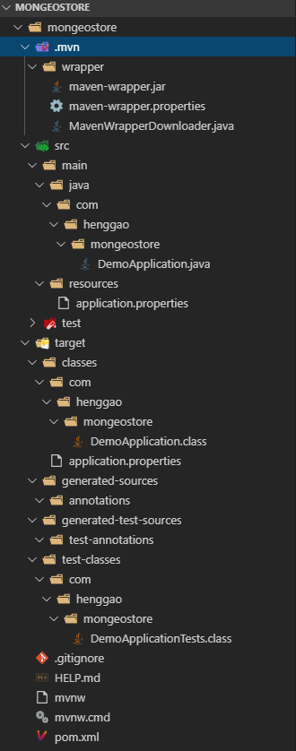
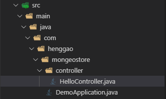
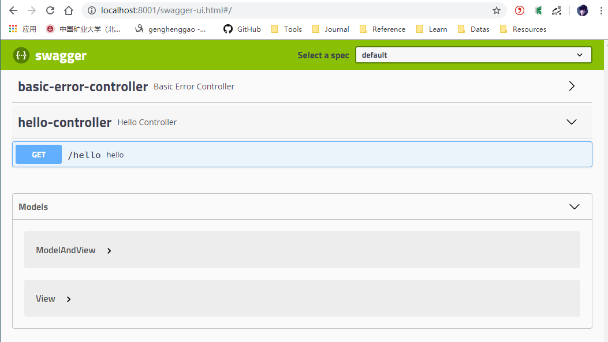
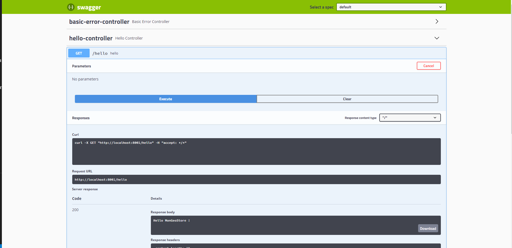
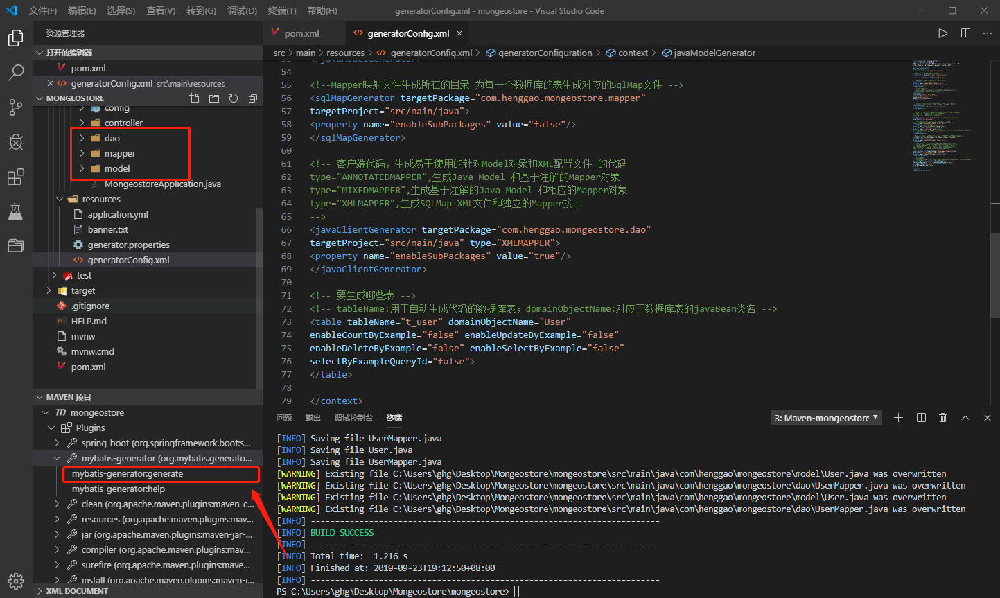
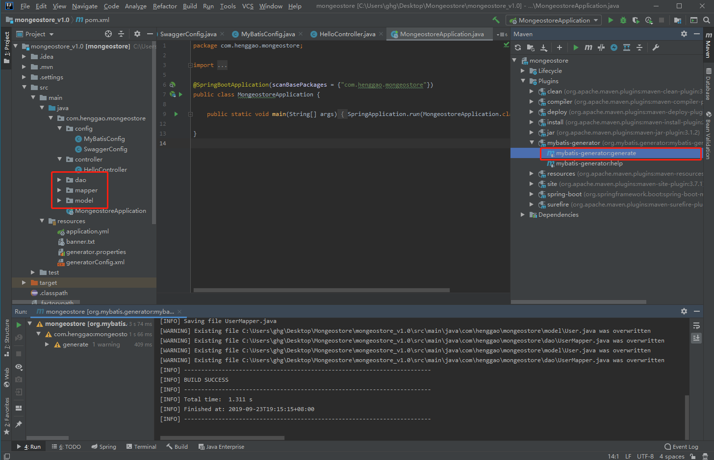
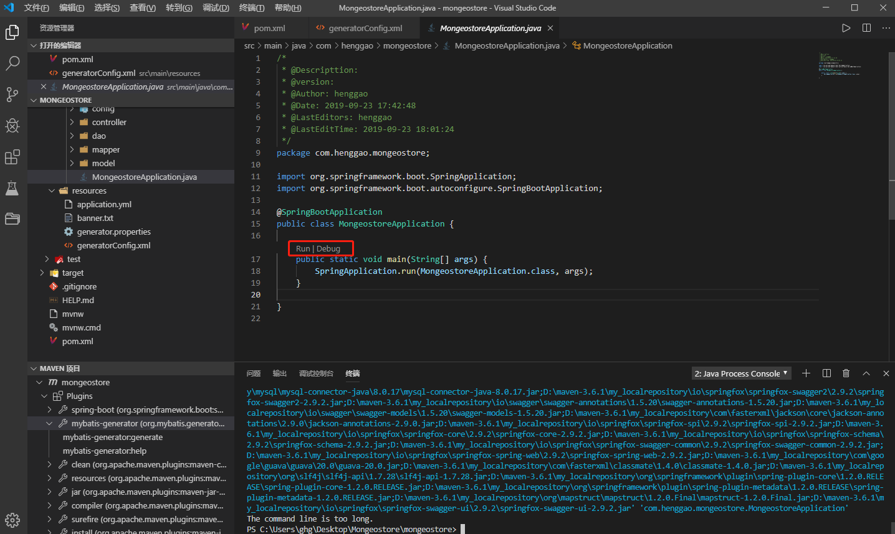
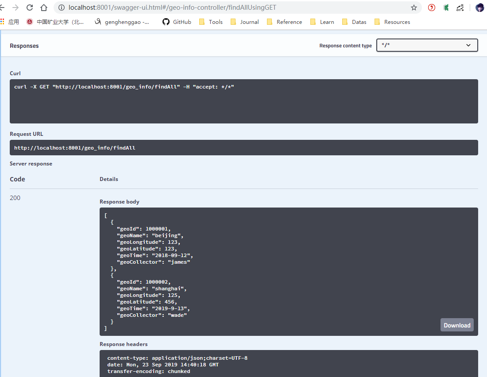

# MonGeoStore

[TOC]

## 准备

- 前端

  - 开发环境
    - IDE：VSCode
  - 技术选型
    - 前端框架：Vue
    - 页面组件：Element
    - 状态管理：Vuex
    - 后台交互：axios
    - 图标使用：Font Awesome
  - 项目结构
    - MonGeoStore-UI
      - bulid
      - config
      - src

- 后端

  - 开发环境

    - IDE：VSCode

    - JDK：JDK1.8.x

      ```shell
      java -version
      ```

      

    - Maven：Maven3.6.x

      ```shell
      mvn -version
      ```

      ​	

    - MongoDB

    - MySQL

  - 技术选型

    - 核心框架：Spring Boot
    - 服务治理：Spring Cloud Finchley
    - 安全框架：Spring Security
    - 视图框架：Spring MVC
    - 持久层框架：MyBatis
    - 数据库连接池：Druid
    - 消息队列：RabbitMQ
    - 接口文档：Swagger
    - 日志管理：SLF4J、Log4j

  - 项目结构

    - MonGeoStore-common
    - MonGeoStore-core
    - 

## 一、创建SpringBoot项目

1、vscode创建Spring Boot项目，组合键`Ctrl++Shfit+P`

2、查看目录结构

​	

3、配置pom.xml

```XML
<?xml version="1.0" encoding="UTF-8" ?>
<project xmlns="http://maven.apache.org/POM/4.0.0" xmlns:xsi="http://www.w3.org/2001/XMLSchema-instance" xsi:schemaLocation="http://maven.apache.org/POM/4.0.0 https://maven.apache.org/xsd/maven-4.0.0.xsd">
	<modelVersion>4.0.0</modelVersion>
	<parent>
		<groupId>org.springframework.boot</groupId>
		<artifactId>spring-boot-starter-parent</artifactId>
		<version>2.1.8.RELEASE</version>
		<relativePath /> <!-- lookup parent from repository -->
	</parent>
	<groupId>com.henggao</groupId>
	<artifactId>mongeostore</artifactId>
	<version>0.0.1-SNAPSHOT</version>
	<name>demo</name>
	<description>Demo project for Spring Boot</description>

	<properties>
		<!--add-->
		<project.build.sourceEncoding>UTF-8</project.build.sourceEncoding>
		<project.reporting.putputEncoding>UTF-8</project.reporting.putputEncoding>
		<!--add-->
		<java.version>1.8</java.version>
	</properties>

	<dependencies>
		<dependency>
			<groupId>org.springframework.boot</groupId>
			<artifactId>spring-boot-starter-web</artifactId>
		</dependency>

		<dependency>
			<groupId>org.springframework.boot</groupId>
			<artifactId>spring-boot-devtools</artifactId>
			<scope>runtime</scope>
			<optional>true</optional>
		</dependency>
		<dependency>
			<groupId>org.projectlombok</groupId>
			<artifactId>lombok</artifactId>
			<optional>true</optional>
		</dependency>
		<dependency>
			<groupId>org.springframework.boot</groupId>
			<artifactId>spring-boot-starter-test</artifactId>
			<scope>test</scope>
		</dependency>
	</dependencies>

	<build>
		<plugins>
			<plugin>
				<groupId>org.springframework.boot</groupId>
				<artifactId>spring-boot-maven-plugin</artifactId>
			</plugin>
		</plugins>
	</build>

</project>
```

4、打成jar包

右击`pom.xml`,运行`Run Code`，控制台输出如下：


​	

5、启动应用

运行DemoApliaction.java


6、修改启动端口

修改application.yml（application.properties修改为application.yml）

```yml
server:
  port: 8001
```

7、自定义Banner

定制自己的Banner，在resources下新建banner.txt,输入“MonGeosStore”字符即可。

字符生成：

- 访问网站[http://patorjk.com/software/taag/#p=display&f=Graffiti&t=Type%20Something%20](http://patorjk.com/software/taag/#p=display&f=Graffiti&t=Type Something )
- 选择Doom类型

在banner.txt中输入如下：

```
___  ___            _____            _____ _                 
|  \/  |           |  __ \          /  ___| |                
| .  . | ___  _ __ | |  \/ ___  ___ \ `--.| |_ ___  _ __ ___ 
| |\/| |/ _ \| '_ \| | __ / _ \/ _ \ `--. \ __/ _ \| '__/ _ \
| |  | | (_) | | | | |_\ \  __/ (_) /\__/ / || (_) | | |  __/
\_|  |_/\___/|_| |_|\____/\___|\___/\____/ \__\___/|_|  \___|
                                                             
| MonGeoStore Application | Version 0.01 |                   
                                                              
```

重新启动即可


8、接口测试

浏览器访问 localhost:8001，因为没有用提供访问内容，所以没有可映射访问内容


新建一个个controller包，并创建HelloController类，添加hello接口



```java
/*
 * @Descripttion: 
 * @version: 
 * @Author: henggao
 * @Date: 2019-09-22 15:29:11
 * @LastEditors: henggao
 * @LastEditTime: 2019-09-22 15:43:09
 */
package com.henggao.mongeostore.controller;

import org.springframework.web.bind.annotation.GetMapping;
import org.springframework.web.bind.annotation.RestController;

/**
 * HelloController
 */
@RestController
public class HelloController {

    @GetMapping(value = "/hello")
    public Object hello() {
        return "Hello MonGeoStore !";
    }
}
```

重启应用，浏览器输入 localhost:8001/hello


## 二、集成Swagger文档

1、在pom.xml中添加Maven依赖

```xml
<!-- Swagger -->
<dependency>
    <groupId>io.springfox</groupId>
    <artifactId>springfox-swagger2</artifactId>
    <version>2.9.2</version>
</dependency>
<dependency>
    <groupId>io.springfox</groupId>
    <artifactId>springfox-swagger-ui</artifactId>
    <version>2.9.2</version>
</dependency>
```

2、配置类

新建config包，并在其下添加Swagger配置类SwaggerConfig.java

```java
/*
 * @Descripttion: 
 * @version: 
 * @Author: henggao
 * @Date: 2019-09-22 16:41:11
 * @LastEditors: henggao
 * @LastEditTime: 2019-09-22 16:41:11
 */
package com.henggao.mongeostore.config;

import org.springframework.context.annotation.Bean;
import org.springframework.context.annotation.Configuration;

import springfox.documentation.builders.ApiInfoBuilder;
import springfox.documentation.builders.PathSelectors;
import springfox.documentation.builders.RequestHandlerSelectors;
import springfox.documentation.service.ApiInfo;
import springfox.documentation.spi.DocumentationType;
import springfox.documentation.spring.web.plugins.Docket;
import springfox.documentation.swagger2.annotations.EnableSwagger2;

/**
 * SwaggerConfig
 */
@Configuration
@EnableSwagger2
public class SwaggerConfig {

    @Bean
    public Docket createRestApi(){

        return new Docket(DocumentationType.SWAGGER_2).apiInfo(apiInfo()).select().apis(RequestHandlerSelectors.any()).paths(PathSelectors.any()).build();
    }

    private ApiInfo apiInfo() {
        return new ApiInfoBuilder().build();
    }
}
```

3、页面测试

启动应用，在浏览器中访问 localhost:8001/swagger-ui.html#/，可以看到Swagger的接口文档页面



单击hello接口，点击 Try it out --> Execute, 可以看到返回“Hello MonGeoStore !”




## 三、集成MyBatis框架

- MyBatis是优秀的持久层框架，支持SQL。

1、在pom.xml中添加Maven依赖

```xml
<!-- MyBatis -->
<dependency>
    <groupId>org.mybatis.spring.boot</groupId>
    <artifactId>mybatis-spring-boot-starter</artifactId>
    <version>2.1.0</version>
</dependency>

<!-- Mysql -->
<dependency>
    <groupId>mysql</groupId>
    <artifactId>mysql-connector-java</artifactId>
    <version>8.0.17</version>
</dependency>
```

2、添加配置

2.1添加MyBatis配置

添加MyBatis配置类，配置相关扫描路径，包括DAO、Model、XML映射文件的扫描。

在config包下新建一个MyBatis配置类MyBatisConfig.java

```java
/*
 * @Descripttion: 
 * @version: 
 * @Author: henggao
 * @Date: 2019-09-22 17:30:00
 * @LastEditors: henggao
 * @LastEditTime: 2019-09-22 18:41:02
 */
package com.henggao.mongeostore.config;

import javax.sql.DataSource;

import org.apache.ibatis.session.SqlSessionFactory;
import org.mybatis.spring.SqlSessionFactoryBean;
import org.mybatis.spring.annotation.MapperScan;
import org.springframework.beans.factory.annotation.Autowired;
import org.springframework.context.annotation.Bean;
import org.springframework.context.annotation.Configuration;
import org.springframework.core.io.support.PathMatchingResourcePatternResolver;

/**
 * MyBatisConfig
 */
@Configuration
@MapperScan("com.henggao.mongeostore.**.dao") // 扫描DAO
public class MyBatisConfig {
    @Autowired
    private DataSource dataSource;

    @Bean
    public SqlSessionFactory sqlSessionFactory() throws Exception {

        SqlSessionFactoryBean sessionFactory = new SqlSessionFactoryBean();
        sessionFactory.setDataSource(dataSource);
        sessionFactory.setTypeAliasesPackage("com.henggao.mongeostore.**.model"); // 扫描Model
        PathMatchingResourcePatternResolver resolver = new PathMatchingResourcePatternResolver();
        sessionFactory.setMapperLocations(resolver.getResources("classpath*:**/mapper/*.xml")); // 扫描映射文件

        return sessionFactory.getObject();

    }

}
```

2.2、添加数据源配置

打开应用配置，添加MySQL数据源连接信息application.yml

```yml
spring:
  datasource:
    driver-class-name: com.mysql.cj.jdbc.Driver
    url: jdbc:mysql://192.168.56.1:3306/mongeostore?useUnicode=true&zeroDateTimeBehavior= convertToNull&autoReconnect= true&characterEncoding=utf-8
    username: henggao
    password: abc123
```

2.3、修改启动类

给启动类MongeostoreApplication的@SpringBootApplication注解配置包扫描，表示在应用启动时自动扫描com.henggao.mogeostore下的内容。（SpringBoot默认默认会扫描启动类包下及子包的组件）

```java
/*
 * @Descripttion: 
 * @version: 
 * @Author: henggao
 * @Date: 2019-09-22 14:17:03
 * @LastEditors: henggao
 * @LastEditTime: 2019-09-22 14:17:03
 */
package com.henggao.mongeostore;

import org.springframework.boot.SpringApplication;
import org.springframework.boot.autoconfigure.SpringBootApplication;

@SpringBootApplication(scanBasePackages = {"com.henggao.mongeostore"})
public class MongostoreApplication {

	public static void main(String[] args) {
		SpringApplication.run(MongostoreApplication.class, args);
	}

}
```

2.4、生成MyBatis模板

- 手动编写MyBatis的Model、Dao、XML映射比较繁琐，通常使用一些工具生成。（MyBatis Generator）
- MyBatis Generator官网：http://mybatis.org/generator/index.html

这里我们使用Vscode或IDEA使用Maven构建，在pom.xml中添加配置信息。

- 依赖

```xml
<!-- MyBatis -->
<dependency>
    <groupId>org.mybatis.spring.boot</groupId>
    <artifactId>mybatis-spring-boot-starter</artifactId>
    <version>2.1.0</version>
</dependency>
<!-- Mysql -->
<dependency>
    <groupId>mysql</groupId>
    <artifactId>mysql-connector-java</artifactId>
    <version>8.0.17</version>
</dependency>
```

- 插件

```xml
<plugin>
    <groupId>org.mybatis.generator</groupId>
    <artifactId>mybatis-generator-maven-plugin</artifactId>
    <version>1.3.7</version>
    <configuration>
        <verbose>true</verbose>
        <overwrite>true</overwrite>
    </configuration>
</plugin>
```

在resources目录下新建generator.properties,添加如下信息

```properties
jdbc.driverLocation=D:\\maven-3.6.1\\my_localrepository\\mysql\\mysql-connector-java\\8.0.17\\mysql-connector-java-8\
  .0.17.jar
jdbc.driverClass= com.mysql.cj.jdbc.Driver
jdbc.connectionURL= jdbc:mysql://192.168.56.1:3306/mongeostore 
jdbc.userId= henggao
jdbc.password= abc123
```

在resources目录下新建generatorConfig.xml,添加如下信息

```xml
<?xml version="1.0" encoding="UTF-8"?>
<!DOCTYPE generatorConfiguration
PUBLIC "-//mybatis.org//DTD MyBatis Generator Configuration 1.0//EN"
"http://mybatis.org/dtd/mybatis-generator-config_1_0.dtd">

<generatorConfiguration>
    <!--导入属性配置-->
    <properties resource="generator.properties"></properties>

    <!--指定特定数据库的jdbc驱动jar包的位置-->
    <classPathEntry location="${jdbc.driverLocation}"/>

    <context id="default" targetRuntime="MyBatis3">

        <!-- optional，旨在创建class时，对注释进行控制 -->
        <commentGenerator>
            <property name="suppressDate" value="true"/>
            <property name="suppressAllComments" value="true"/>
        </commentGenerator>

        <!--jdbc的数据库连接 -->
        <!--connectionURL="jdbc:mysql://192.168.56.1:3306/mongeostore" -->
        <!--connectionURL="${jdbc.connectionURL}" -->
        <jdbcConnection driverClass="${jdbc.driverClass}" connectionURL="${jdbc.connectionURL}" userId="${jdbc.userId}" password="${jdbc.password}">
        </jdbcConnection>


        <!-- 非必需，类型处理器，在数据库类型和java类型之间的转换控制-->
        <javaTypeResolver>
            <property name="forceBigDecimals" value="false"/>
        </javaTypeResolver>


        <!-- Model模型生成器,用来生成含有主键key的类，记录类 以及查询Example类
targetPackage     指定生成的model生成所在的包名
targetProject     指定在该项目下所在的路径
-->
        <javaModelGenerator targetPackage="com.henggao.mongeostore.model" targetProject="src/main/java">

            <!-- 是否允许子包，即targetPackage.schemaName.tableName -->
            <property name="enableSubPackages" value="false"/>
            <!-- 是否对model添加 构造函数 -->
            <property name="constructorBased" value="true"/>
            <!-- 是否对类CHAR类型的列的数据进行trim操作 -->
            <property name="trimStrings" value="true"/>
            <!-- 建立的Model对象是否 不可改变  即生成的Model对象不会有 setter方法，只有构造方法 -->
            <property name="immutable" value="false"/>
        </javaModelGenerator>

        <!--Mapper映射文件生成所在的目录 为每一个数据库的表生成对应的SqlMap文件 -->
        <sqlMapGenerator targetPackage="com.henggao.mongeostore.mapper" targetProject="src/main/java">
            <property name="enableSubPackages" value="false"/>
        </sqlMapGenerator>

        <!-- 客户端代码，生成易于使用的针对Model对象和XML配置文件 的代码 type="ANNOTATEDMAPPER",生成Java Model 和基于注解的Mapper对象 type="MIXEDMAPPER",生成基于注解的Java Model 和相应的Mapper对象 type="XMLMAPPER",生成SQLMap XML文件和独立的Mapper接口
-->
        <javaClientGenerator targetPackage="com.henggao.mongeostore.dao" targetProject="src/main/java" type="XMLMAPPER">
            <property name="enableSubPackages" value="true"/>
        </javaClientGenerator>

        <!-- 要生成哪些表 -->
        <!-- tableName:用于自动生成代码的数据库表；domainObjectName:对应于数据库表的javaBean类名 -->
        <table tableName="geo_info" domainObjectName="GeoInfo" enableCountByExample="false" enableUpdateByExample="false" enableDeleteByExample="false" enableSelectByExample="false" selectByExampleQueryId="false">
        </table>

    </context>
</generatorConfiguration>
```

Vscode在Maven项目Plugins下找到mybatis-generator，运行即可



IDEA在Maven项目Plugins下找到mybatis-generator，运行即可



参考：

https://blog.csdn.net/hua_faded/article/details/78900780

https://www.cnblogs.com/hhhshct/p/9331043.html

https://blog.51cto.com/zero01/2103687

**注意：**Vscode中run运行MongeostoreApplication时，会报错，这里使用Debug方式运行。




2.5、编写服务接口

1）、在Mapper中添加一个findAll方法，GeoInfoMapper.java

```java
/*
 * @Descripttion: 
 * @version: 
 * @Author: henggao
 * @Date: 2019-09-23 22:21:44
 * @LastEditors: henggao
 * @LastEditTime: 2019-09-23 22:21:44
 */
package com.henggao.mongeostore.dao;

import java.util.List;

import com.henggao.mongeostore.model.GeoInfo;

public interface GeoInfoMapper {
    int deleteByPrimaryKey(Integer geoId);

    int insert(GeoInfo record);

    int insertSelective(GeoInfo record);

    GeoInfo selectByPrimaryKey(Integer geoId);

    int updateByPrimaryKeySelective(GeoInfo record);

    int updateByPrimaryKey(GeoInfo record);

    
    /**
     * 查询全部
     * @return
     */
    List<GeoInfo> findAll();
}
```

2）、在映射文件中添加一个查询方法GeoInfoMapper.xml

```xml
<?xml version="1.0" encoding="UTF-8"?>
<!DOCTYPE mapper PUBLIC "-//mybatis.org//DTD Mapper 3.0//EN" "http://mybatis.org/dtd/mybatis-3-mapper.dtd">
<mapper namespace="com.henggao.mongeostore.dao.AdminMapper">
  <resultMap id="BaseResultMap" type="com.henggao.mongeostore.model.Admin">
    <constructor>
      <idArg column="user_id" javaType="java.lang.Integer" jdbcType="INTEGER" />
      <arg column="user_name" javaType="java.lang.String" jdbcType="VARCHAR" />
      <arg column="password" javaType="java.lang.String" jdbcType="VARCHAR" />
      <arg column="phone" javaType="java.lang.String" jdbcType="VARCHAR" />
    </constructor>
  </resultMap>
  <sql id="Base_Column_List">
    user_id, user_name, password, phone
  </sql>
  <select id="selectByPrimaryKey" parameterType="java.lang.Integer" resultMap="BaseResultMap">
    select 
    <include refid="Base_Column_List" />
    from admin
    where user_id = #{userId,jdbcType=INTEGER}
  </select>
  <delete id="deleteByPrimaryKey" parameterType="java.lang.Integer">
    delete from admin
    where user_id = #{userId,jdbcType=INTEGER}
  </delete>
  <insert id="insert" parameterType="com.henggao.mongeostore.model.Admin">
    insert into admin (user_id, user_name, password, 
      phone)
    values (#{userId,jdbcType=INTEGER}, #{userName,jdbcType=VARCHAR}, #{password,jdbcType=VARCHAR}, 
      #{phone,jdbcType=VARCHAR})
  </insert>
  <insert id="insertSelective" parameterType="com.henggao.mongeostore.model.Admin">
    insert into admin
    <trim prefix="(" suffix=")" suffixOverrides=",">
      <if test="userId != null">
        user_id,
      </if>
      <if test="userName != null">
        user_name,
      </if>
      <if test="password != null">
        password,
      </if>
      <if test="phone != null">
        phone,
      </if>
    </trim>
    <trim prefix="values (" suffix=")" suffixOverrides=",">
      <if test="userId != null">
        #{userId,jdbcType=INTEGER},
      </if>
      <if test="userName != null">
        #{userName,jdbcType=VARCHAR},
      </if>
      <if test="password != null">
        #{password,jdbcType=VARCHAR},
      </if>
      <if test="phone != null">
        #{phone,jdbcType=VARCHAR},
      </if>
    </trim>
  </insert>
  <update id="updateByPrimaryKeySelective" parameterType="com.henggao.mongeostore.model.Admin">
    update admin
    <set>
      <if test="userName != null">
        user_name = #{userName,jdbcType=VARCHAR},
      </if>
      <if test="password != null">
        password = #{password,jdbcType=VARCHAR},
      </if>
      <if test="phone != null">
        phone = #{phone,jdbcType=VARCHAR},
      </if>
    </set>
    where user_id = #{userId,jdbcType=INTEGER}
  </update>
  <update id="updateByPrimaryKey" parameterType="com.henggao.mongeostore.model.Admin">
    update admin
    set user_name = #{userName,jdbcType=VARCHAR},
      password = #{password,jdbcType=VARCHAR},
      phone = #{phone,jdbcType=VARCHAR}
    where user_id = #{userId,jdbcType=INTEGER}
  </update>

  <!-- 添加一个findAll查询 -->
  <select id="findAll" resultMap="BaseResultMap">
    select
    <include refid="Base_Column_List" />
    from geo_info
  </select>
</mapper>
```

3）、编写管理接口GeoInfoService.java,新建一个service文件夹，其下新建GeoInfoService.java

```java
/*
 * @Descripttion: 
 * @version: 
 * @Author: henggao
 * @Date: 2019-09-23 22:26:19
 * @LastEditors: henggao
 * @LastEditTime: 2019-09-23 22:26:19
 */
package com.henggao.mongeostore.service;

import java.util.List;

import com.henggao.mongeostore.model.GeoInfo;

/**
 * GeoInfoService
 */
public interface GeoInfoService {

    /**
     * 查询所有用户
     * 
     * @return
     */
    List<GeoInfo> findAll();
}
```

在service文件夹下新建impl文件夹，其下新建GeoInfoServiceImpl.java

```java
/*
 * @Descripttion: 
 * @version: 
 * @Author: henggao
 * @Date: 2019-09-23 22:28:54
 * @LastEditors: henggao
 * @LastEditTime: 2019-09-23 22:28:54
 */
package com.henggao.mongeostore.service.impl;

import java.util.List;

import com.henggao.mongeostore.dao.GeoInfoMapper;
import com.henggao.mongeostore.model.GeoInfo;
import com.henggao.mongeostore.service.GeoInfoService;

import org.springframework.beans.factory.annotation.Autowired;
import org.springframework.stereotype.Service;

/**
 * GeoInfoServiceImpl
 */
@Service
public class GeoInfoServiceImpl implements GeoInfoService {

    @Autowired
    private GeoInfoMapper geoInfoMapper;

    @Override
    public List<GeoInfo> findAll() {
        return geoInfoMapper.findAll();
    }
}
```

4）、编写RESTful接口，放回JSON数据格式，在controller文件夹下新建GeoInfoController.java

```java
/*
 * @Descripttion: 
 * @version: 
 * @Author: henggao
 * @Date: 2019-09-23 22:32:24
 * @LastEditors: henggao
 * @LastEditTime: 2019-09-23 22:32:24
 */
package com.henggao.mongeostore.controller;

import com.henggao.mongeostore.service.GeoInfoService;

import org.springframework.beans.factory.annotation.Autowired;
import org.springframework.web.bind.annotation.GetMapping;
import org.springframework.web.bind.annotation.RequestMapping;
import org.springframework.web.bind.annotation.RestController;

/**
 * GeoInfoController
 */
@RestController
@RequestMapping("geo_info")
public class GeoInfoController {

    @Autowired
    private GeoInfoService geoInfoService;

    @GetMapping(value = "/findAll")
    public Object findAll() {
        return geoInfoService.findAll();
    }
}
```

2.6、配置打包资源

在pom.xml下添加如下信息，打包时MyBatis映射文件也会复制过去。

```xml
<!-- 打包时拷贝MyBatis的映射文件 -->
<resources>
    <resource>
        <directory>src/main/java</directory>
        <includes>
            <include>**/mapper/*.xml</include>
        </includes>
        <filtering>false</filtering>
    </resource>
    <resource>  
        <directory>src/main/resources</directory>  
        <includes> 
            <include>**/*.*</include>  
        </includes> 
        <filtering>true</filtering>  
    </resource> 
</resources>
```

2.7、启动MongeostoreApplication，访问 localhost:8001/geo_info/findAll，可以看到如下信息


在Swagger进行测试

