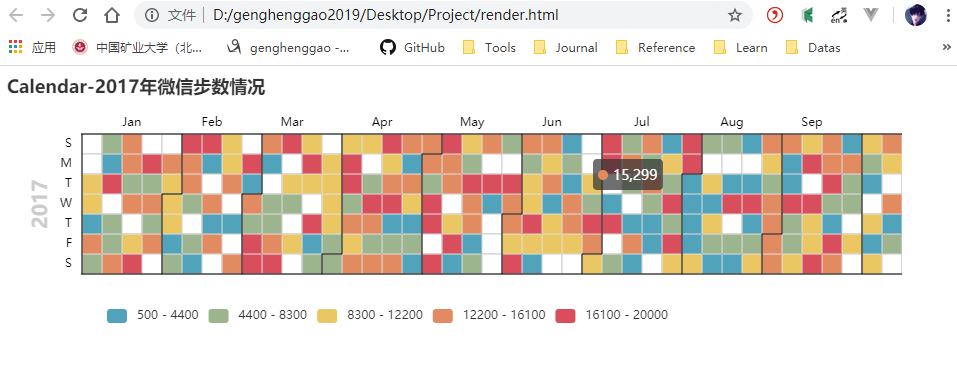

# PyEchart

[TOC]

- 2020.1.15

## 一、什么是PyEcharts

pyecharts 是一个用于生成 Echarts 图表的类库。

echarts 是百度开源的一个数据可视化 JS 库，主要用于数据可视化。pyecharts 是一个用于生成 Echarts 图表的类库。实际上就是 Echarts 与 Python 的对接。

使用 pyecharts 可以生成独立的网页，也可以在 flask , Django 中集成使用。


## 二、PyEcharts包含的图表

```
　　Bar（柱状图/条形图） 
　　Bar3D（3D 柱状图） 
　　Boxplot（箱形图） 
　　EffectScatter（带有涟漪特效动画的散点图） 
　　Funnel（漏斗图） 
　　Gauge（仪表盘） 
　　Geo（地理坐标系） 
　　Graph（关系图） 
　　HeatMap（热力图） 
　　Kline（K线图） 
　　Line（折线/面积图） 
　　Line3D（3D 折线图） 
　　Liquid（水球图） 
　　Map（地图） 
　　Parallel（平行坐标系） 
　　Pie（饼图） 
　　Polar（极坐标系） 
　　Radar（雷达图） 
　　Sankey（桑基图） 
　　Scatter（散点图） 
　　Scatter3D（3D 散点图） 
　　ThemeRiver（主题河流图） 
　　WordCloud（词云图）
 
　　用户自定义
 
　　Grid 类：并行显示多张图 
　　Overlap 类：结合不同类型图表叠加画在同张图上 
　　Page 类：同一网页按顺序展示多图 
　　Timeline 类：提供时间线轮播多张图
 
```


## 三、安装PyEcharts

```shell
pip install pyecharts
```

这里要专门说明一下，自从 0.3.2 开始，为了缩减项目本身的体积以及维持 pyecharts 项目的轻量化运行，pyecharts 将不再自带地图 js 文件。如用户需要用到地图图表（Geo、Map），可自行安装对应的地图文件包。
否则在用到这两个包的时候，并能完整的显示地图效果。


## 四、测试

### 1、柱状图

```python
from pyecharts.charts import Bar

bar = Bar()
bar.add_xaxis(["衬衫", "羊毛衫", "雪纺衫", "裤子", "高跟鞋", "袜子"])
bar.add_yaxis("商家A", [5, 20, 36, 10, 75, 90])
# render 会生成本地 HTML 文件，默认会在当前目录生成 render.html 文件
# 也可以传入路径参数，如 bar.render("mycharts.html")
bar.render()
```

生成一个render.html文件，浏览器打开查看


### 2、微信步数

```python
import datetime
import random

from pyecharts import options as opts
from pyecharts.charts import Calendar


def calendar_base() -> Calendar:
    begin = datetime.date(2017, 1, 1)
    end = datetime.date(2017, 12, 31)
    data = [
        [str(begin + datetime.timedelta(days=i)), random.randint(1000, 25000)]
        for i in range((end - begin).days + 1)
    ]

    c = (
        Calendar()
        .add("", data, calendar_opts=opts.CalendarOpts(range_="2017"))
        .set_global_opts(
            title_opts=opts.TitleOpts(title="Calendar-2017年微信步数情况"),
            visualmap_opts=opts.VisualMapOpts(
                max_=20000,
                min_=500,
                orient="horizontal",
                is_piecewise=True,
                pos_top="230px",
                pos_left="100px",
            ),
        )
    )
    return c
calendar_base().render()
```

生成一个render.html文件，浏览器打开查看



参考：https://pyecharts.org/#/


