[TOC]


# 一、windows下IDEA结合maven开发spark

- 开发环境
  - CentOS7.6
  - Scala2.13.0
  - Maven3.6.1
- 采用jar提交集群模式流程
  - 本地完成代码开发 –> 本地编译打包 -> 提交集群执行

## 1、新建Maven工程

### 1、在 IDEA 上新建Maven 项目，Create New Project


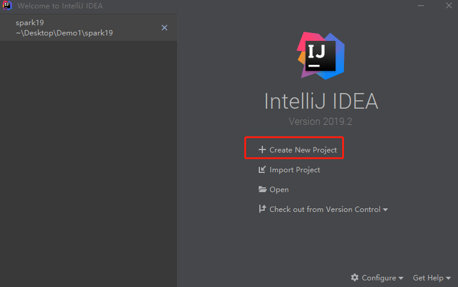

### 2、点击Maven-->Next

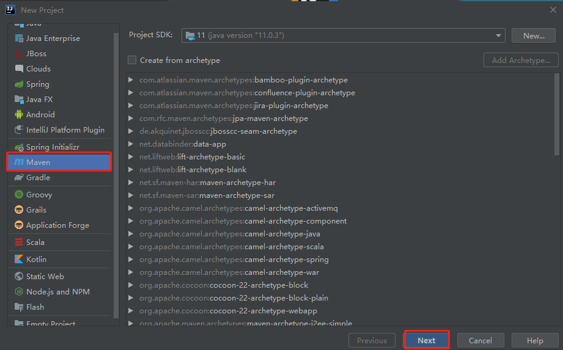

### 3、输入信息，点击Next

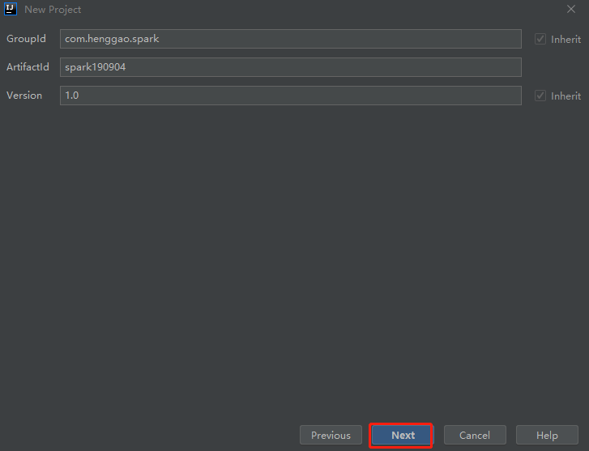

### 4、确认信息-->Finish

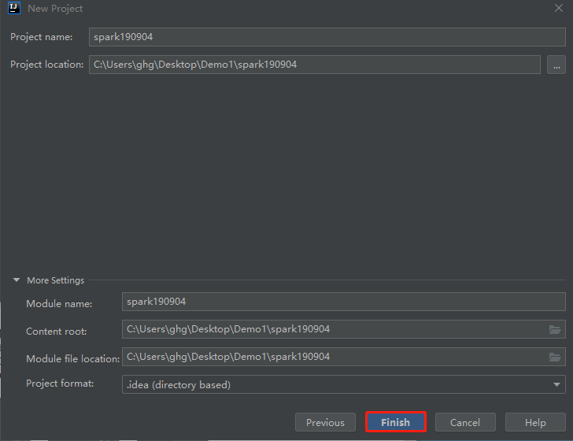

### 5、看一下初始目录结构

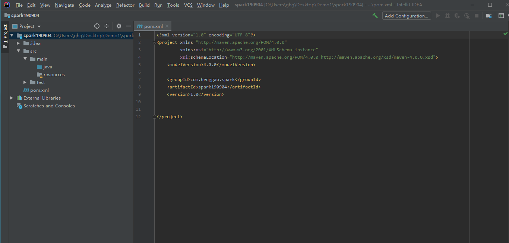

## 2、编写Scala

### 1、编辑pom.xml

```xml
<?xml version="1.0" encoding="UTF-8"?>
<project xmlns="http://maven.apache.org/POM/4.0.0"
         xmlns:xsi="http://www.w3.org/2001/XMLSchema-instance"
         xsi:schemaLocation="http://maven.apache.org/POM/4.0.0 http://maven.apache.org/xsd/maven-4.0.0.xsd">
    <modelVersion>4.0.0</modelVersion>

    <groupId>com.mongeostore.spark</groupId>
    <artifactId>spark-190904</artifactId>
    <version>1.0-SNAPSHOT</version>

    <!-- 注意:这里scala的版本要和自己电脑上安装的scala一致，而且要注意spark对应的版本是否支持scala对应的版本。否则会存在版本冲突问题 -->
    <!-- 中央仓库查看对应版本-->
    <properties>
        <spark.version>2.4.4</spark.version>
        <scala.version>2.11</scala.version>
        <hadoop.version>3.1.2</hadoop.version>
    </properties>

    <dependencies>
        <dependency>
            <groupId>org.apache.spark</groupId>
            <artifactId>spark-core_${scala.version}</artifactId>
            <version>${spark.version}</version>
        </dependency>
    </dependencies>

    <build>
        <finalName>WordCount</finalName>
        <plugins>
            <!-- 编译scala的插件 -->
            <plugin>
                <groupId>net.alchim31.maven</groupId>
                <artifactId>scala-maven-plugin</artifactId>
                <version>3.2.2</version>
                <executions>
                    <execution>
                        <goals>
                            <goal>compile</goal>
                            <goal>testCompile</goal>
                        </goals>
                    </execution>
                </executions>
            </plugin>
        </plugins>
    </build>

</project>
```

### 2、在src/main下新建文件夹

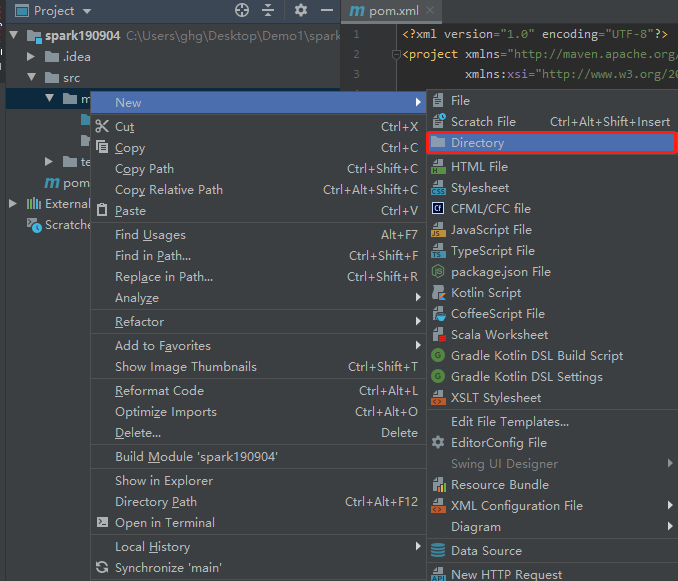

- 输入scala

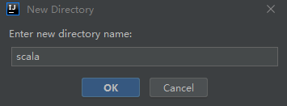

- 右击scala，将scala文件夹设置为Sources Root

  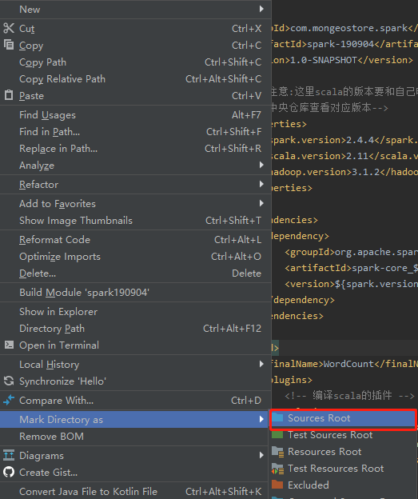

### 3、新建包

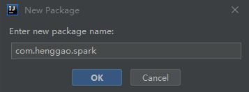

### 4、包下新建Scala Class

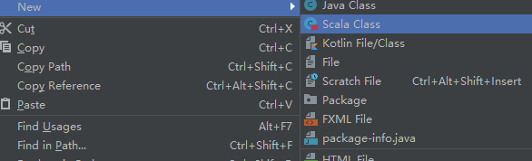

- 输入WordCount

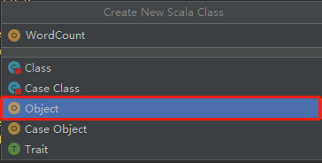

- 看一下目录结构

  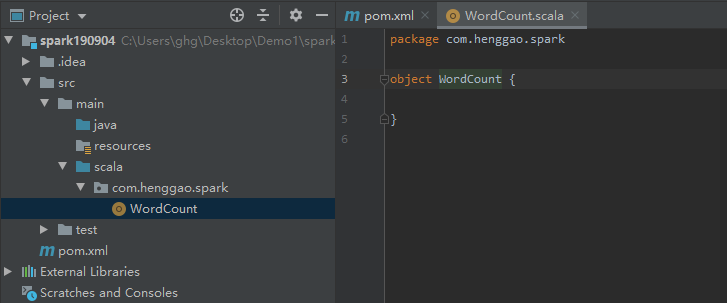

### 5、编写WordCount.scala

```scala
package com.henggao.spark

import org.apache.spark.rdd.RDD
import org.apache.spark.{SparkConf, SparkContext}

object WordCount {

  def main(args: Array[String]): Unit = {
    //使用开发工具编写Spark WordCount的开发

    //local模式
    //创建SparkConf对象
    //设定Spark计算框架的运行（部署）环境
    //app id
    val config: SparkConf = new SparkConf().setMaster("local[*]").setAppName("WordCount")

    //创建Spark上下文对象
    val sc = new SparkContext(config)

    //读取文件，将文件内容一行一行的读取出来
    val lines: RDD[String] = sc.textFile("input")

    //将一行一行的数据分解一个一个单词
    val words: RDD[String] = lines.flatMap(_.split(" "))

    //为了统计方便，将单词数据进行结构的转换
    val wordToOne: RDD[(String, Int)] = words.map((_, 1))

    //对转换结构后的数据进行分分组聚合
    val wordToSum: RDD[(String, Int)] = wordToOne.reduceByKey(_+_)

    //将统计的结果采集后打印到控制台
    val result: Array[(String, Int)] = wordToSum.collect()

    //println(result)
    result.foreach(println)
  }
}
```

## 3、打jar包

### 1、打成jar包

- 右击File-->Project Structure

  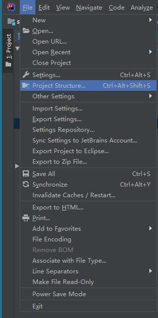

- Artifacts--> + --> JAR --> From modules with denpendencies

  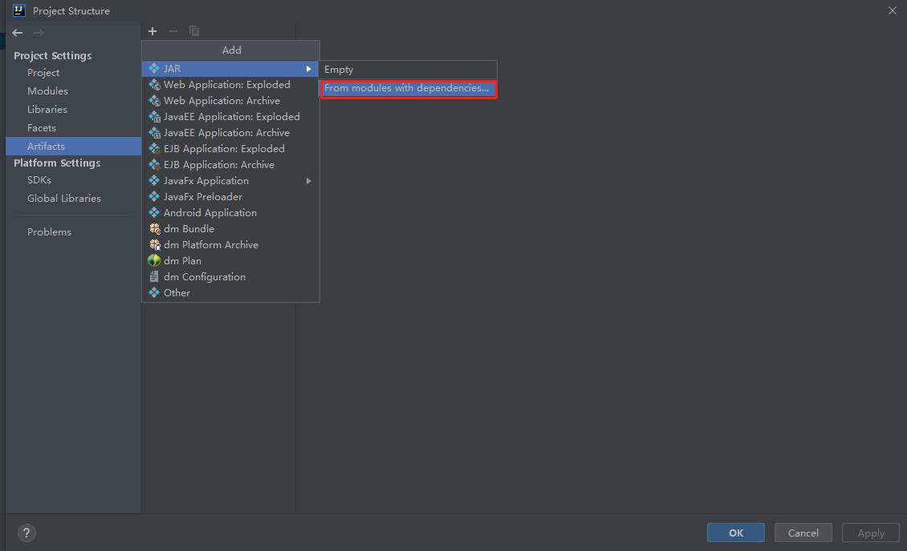

- 出现如下

  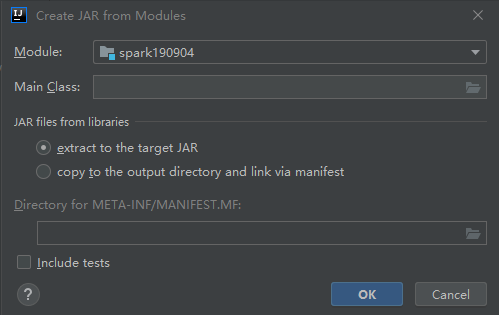

- 添加Man Class，点击OK

  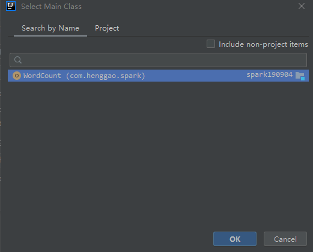

- 选择Directory，点击OK

  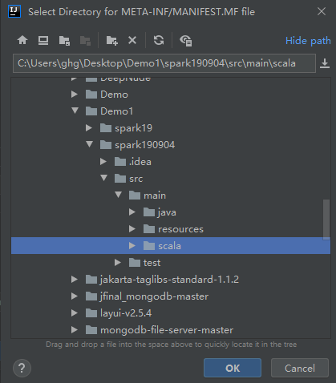

- 修改后如下，点击OK

  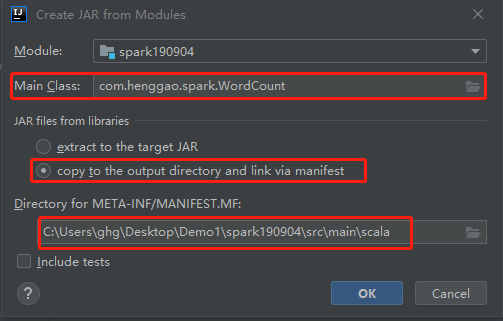

- 点击OK，如下

  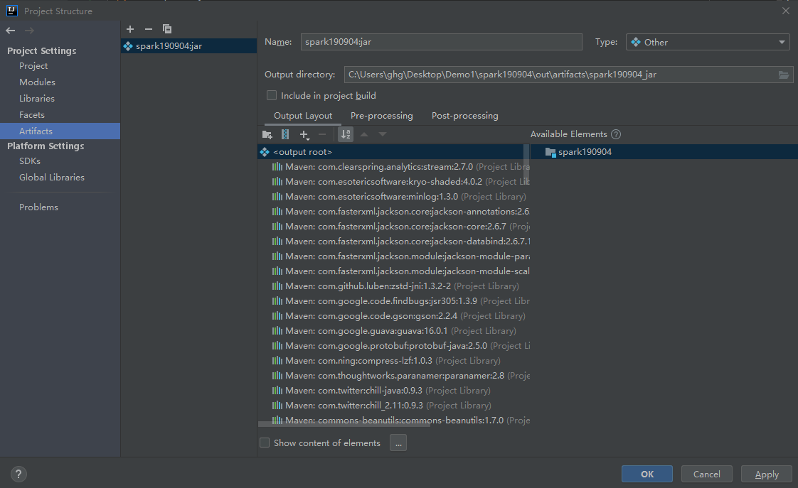

- Bulid --> Bulid Ar

  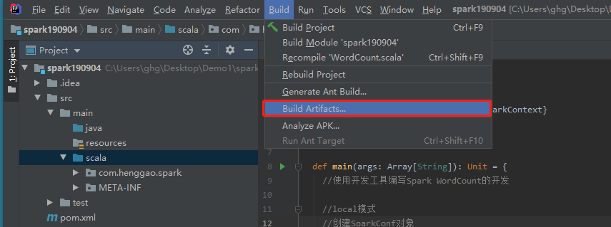

- 选择Build

  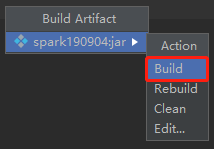

  - build（首次打包）
  - rebuild（重新打包）
  - clean（清理当前内容）

- 完成，看一下目录结构

  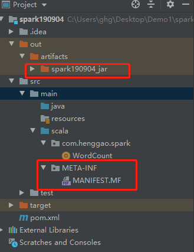

- 查看

  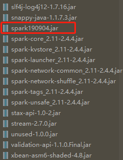

## 4、上传jar包，在Spark上运行

#### 1、将spark190904_jar文件上传到虚拟机Centos（master）上。

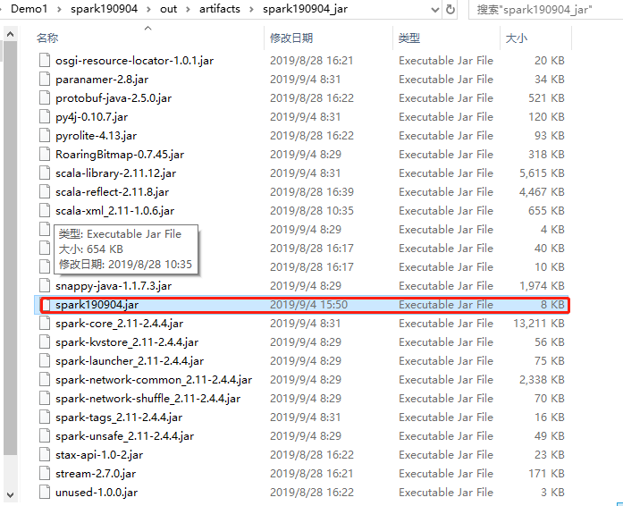

- 我这里上传到/home/hduser/Desktop下

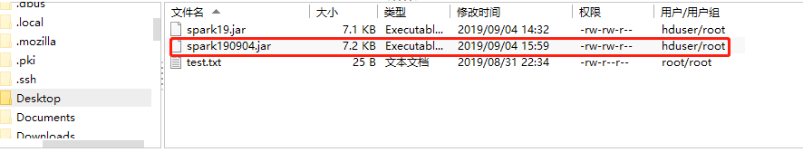

#### 2、在Spark上以local模式运行

1）切换到 `/usr/local/spark-2.4.4-bin-hadoop2.7/bin/`下

```shell
[root@master hduser]# cd /usr/local/spark-2.4.4-bin-hadoop2.7/bin/
```

2）提交任务

```shell
[root@master bin]# ./spark-submit  --master local[*] --class com.henggao.spark.WordCount --name WordCount  /home/hduser/Desktop/spark190904.jar 
```

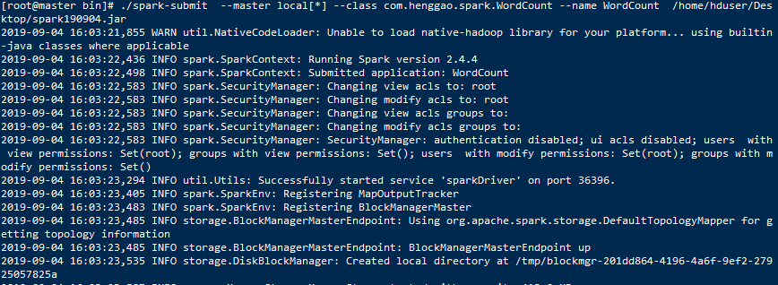

- 查看运行结果

  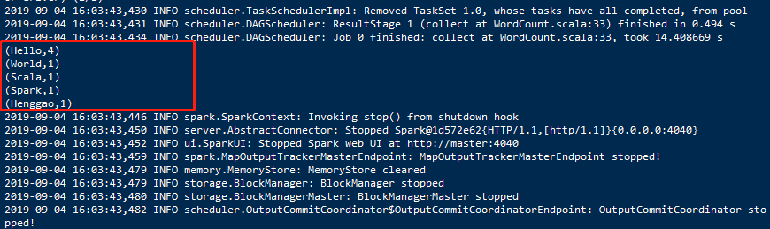

- 全部输出如下

  ```shell
  [root@master bin]# ./spark-submit  --master local[*] --class com.henggao.spark.WordCount --name WordCount  /home/hduser/Desktop/spark190904.jar 
  2019-09-04 16:03:21,855 WARN util.NativeCodeLoader: Unable to load native-hadoop library for your platform... using builtin-java classes where applicable
  2019-09-04 16:03:22,436 INFO spark.SparkContext: Running Spark version 2.4.4
  2019-09-04 16:03:22,498 INFO spark.SparkContext: Submitted application: WordCount
  2019-09-04 16:03:22,583 INFO spark.SecurityManager: Changing view acls to: root
  2019-09-04 16:03:22,583 INFO spark.SecurityManager: Changing modify acls to: root
  2019-09-04 16:03:22,583 INFO spark.SecurityManager: Changing view acls groups to: 
  2019-09-04 16:03:22,583 INFO spark.SecurityManager: Changing modify acls groups to: 
  2019-09-04 16:03:22,583 INFO spark.SecurityManager: SecurityManager: authentication disabled; ui acls disabled; users  with view permissions: Set(root); groups with view permissions: Set(); users  with modify permissions: Set(root); groups with modify permissions: Set()
  2019-09-04 16:03:23,294 INFO util.Utils: Successfully started service 'sparkDriver' on port 36396.
  2019-09-04 16:03:23,405 INFO spark.SparkEnv: Registering MapOutputTracker
  2019-09-04 16:03:23,483 INFO spark.SparkEnv: Registering BlockManagerMaster
  2019-09-04 16:03:23,485 INFO storage.BlockManagerMasterEndpoint: Using org.apache.spark.storage.DefaultTopologyMapper for getting topology information
  2019-09-04 16:03:23,485 INFO storage.BlockManagerMasterEndpoint: BlockManagerMasterEndpoint up
  2019-09-04 16:03:23,535 INFO storage.DiskBlockManager: Created local directory at /tmp/blockmgr-201dd864-4196-4a6f-9ef2-27925057825a
  2019-09-04 16:03:23,587 INFO memory.MemoryStore: MemoryStore started with capacity 413.9 MB
  2019-09-04 16:03:23,626 INFO spark.SparkEnv: Registering OutputCommitCoordinator
  2019-09-04 16:03:23,743 INFO util.log: Logging initialized @4843ms
  2019-09-04 16:03:23,871 INFO server.Server: jetty-9.3.z-SNAPSHOT, build timestamp: unknown, git hash: unknown
  2019-09-04 16:03:23,982 INFO server.Server: Started @5083ms
  2019-09-04 16:03:23,996 INFO server.AbstractConnector: Started ServerConnector@1d572e62{HTTP/1.1,[http/1.1]}{0.0.0.0:4040}
  2019-09-04 16:03:23,996 INFO util.Utils: Successfully started service 'SparkUI' on port 4040.
  2019-09-04 16:03:24,024 INFO handler.ContextHandler: Started o.s.j.s.ServletContextHandler@3c8bdd5b{/jobs,null,AVAILABLE,@Spark}
  2019-09-04 16:03:24,025 INFO handler.ContextHandler: Started o.s.j.s.ServletContextHandler@10b3df93{/jobs/json,null,AVAILABLE,@Spark}
  2019-09-04 16:03:24,025 INFO handler.ContextHandler: Started o.s.j.s.ServletContextHandler@ea27e34{/jobs/job,null,AVAILABLE,@Spark}
  2019-09-04 16:03:24,026 INFO handler.ContextHandler: Started o.s.j.s.ServletContextHandler@e72dba7{/jobs/job/json,null,AVAILABLE,@Spark}
  2019-09-04 16:03:24,026 INFO handler.ContextHandler: Started o.s.j.s.ServletContextHandler@33c2bd{/stages,null,AVAILABLE,@Spark}
  2019-09-04 16:03:24,027 INFO handler.ContextHandler: Started o.s.j.s.ServletContextHandler@1dfd5f51{/stages/json,null,AVAILABLE,@Spark}
  2019-09-04 16:03:24,027 INFO handler.ContextHandler: Started o.s.j.s.ServletContextHandler@3c321bdb{/stages/stage,null,AVAILABLE,@Spark}
  2019-09-04 16:03:24,028 INFO handler.ContextHandler: Started o.s.j.s.ServletContextHandler@4d4d8fcf{/stages/stage/json,null,AVAILABLE,@Spark}
  2019-09-04 16:03:24,028 INFO handler.ContextHandler: Started o.s.j.s.ServletContextHandler@610db97e{/stages/pool,null,AVAILABLE,@Spark}
  2019-09-04 16:03:24,029 INFO handler.ContextHandler: Started o.s.j.s.ServletContextHandler@6f0628de{/stages/pool/json,null,AVAILABLE,@Spark}
  2019-09-04 16:03:24,029 INFO handler.ContextHandler: Started o.s.j.s.ServletContextHandler@3fabf088{/storage,null,AVAILABLE,@Spark}
  2019-09-04 16:03:24,030 INFO handler.ContextHandler: Started o.s.j.s.ServletContextHandler@1e392345{/storage/json,null,AVAILABLE,@Spark}
  2019-09-04 16:03:24,030 INFO handler.ContextHandler: Started o.s.j.s.ServletContextHandler@12f3afb5{/storage/rdd,null,AVAILABLE,@Spark}
  2019-09-04 16:03:24,030 INFO handler.ContextHandler: Started o.s.j.s.ServletContextHandler@4ced35ed{/storage/rdd/json,null,AVAILABLE,@Spark}
  2019-09-04 16:03:24,031 INFO handler.ContextHandler: Started o.s.j.s.ServletContextHandler@2c22a348{/environment,null,AVAILABLE,@Spark}
  2019-09-04 16:03:24,031 INFO handler.ContextHandler: Started o.s.j.s.ServletContextHandler@7bd69e82{/environment/json,null,AVAILABLE,@Spark}
  2019-09-04 16:03:24,032 INFO handler.ContextHandler: Started o.s.j.s.ServletContextHandler@74d7184a{/executors,null,AVAILABLE,@Spark}
  2019-09-04 16:03:24,032 INFO handler.ContextHandler: Started o.s.j.s.ServletContextHandler@51b01960{/executors/json,null,AVAILABLE,@Spark}
  2019-09-04 16:03:24,033 INFO handler.ContextHandler: Started o.s.j.s.ServletContextHandler@6831d8fd{/executors/threadDump,null,AVAILABLE,@Spark}
  2019-09-04 16:03:24,047 INFO handler.ContextHandler: Started o.s.j.s.ServletContextHandler@27dc79f7{/executors/threadDump/json,null,AVAILABLE,@Spark}
  2019-09-04 16:03:24,072 INFO handler.ContextHandler: Started o.s.j.s.ServletContextHandler@6b85300e{/static,null,AVAILABLE,@Spark}
  2019-09-04 16:03:24,073 INFO handler.ContextHandler: Started o.s.j.s.ServletContextHandler@7674a051{/,null,AVAILABLE,@Spark}
  2019-09-04 16:03:24,074 INFO handler.ContextHandler: Started o.s.j.s.ServletContextHandler@3a7704c{/api,null,AVAILABLE,@Spark}
  2019-09-04 16:03:24,074 INFO handler.ContextHandler: Started o.s.j.s.ServletContextHandler@a23a01d{/jobs/job/kill,null,AVAILABLE,@Spark}
  2019-09-04 16:03:24,075 INFO handler.ContextHandler: Started o.s.j.s.ServletContextHandler@4acf72b6{/stages/stage/kill,null,AVAILABLE,@Spark}
  2019-09-04 16:03:24,076 INFO ui.SparkUI: Bound SparkUI to 0.0.0.0, and started at http://master:4040
  2019-09-04 16:03:24,108 INFO spark.SparkContext: Added JAR file:/home/hduser/Desktop/spark190904.jar at spark://master:36396/jars/spark190904.jar with timestamp 1567584204108
  2019-09-04 16:03:24,263 INFO executor.Executor: Starting executor ID driver on host localhost
  2019-09-04 16:03:24,378 INFO util.Utils: Successfully started service 'org.apache.spark.network.netty.NettyBlockTransferService' on port 39765.
  2019-09-04 16:03:24,378 INFO netty.NettyBlockTransferService: Server created on master:39765
  2019-09-04 16:03:24,379 INFO storage.BlockManager: Using org.apache.spark.storage.RandomBlockReplicationPolicy for block replication policy
  2019-09-04 16:03:24,460 INFO storage.BlockManagerMaster: Registering BlockManager BlockManagerId(driver, master, 39765, None)
  2019-09-04 16:03:24,464 INFO storage.BlockManagerMasterEndpoint: Registering block manager master:39765 with 413.9 MB RAM, BlockManagerId(driver, master, 39765, None)
  2019-09-04 16:03:24,466 INFO storage.BlockManagerMaster: Registered BlockManager BlockManagerId(driver, master, 39765, None)
  2019-09-04 16:03:24,467 INFO storage.BlockManager: Initialized BlockManager: BlockManagerId(driver, master, 39765, None)
  2019-09-04 16:03:24,920 INFO handler.ContextHandler: Started o.s.j.s.ServletContextHandler@7923f5b3{/metrics/json,null,AVAILABLE,@Spark}
  2019-09-04 16:03:26,612 INFO memory.MemoryStore: Block broadcast_0 stored as values in memory (estimated size 241.0 KB, free 413.7 MB)
  2019-09-04 16:03:26,864 INFO memory.MemoryStore: Block broadcast_0_piece0 stored as bytes in memory (estimated size 23.3 KB, free 413.7 MB)
  2019-09-04 16:03:26,866 INFO storage.BlockManagerInfo: Added broadcast_0_piece0 in memory on master:39765 (size: 23.3 KB, free: 413.9 MB)
  2019-09-04 16:03:26,905 INFO spark.SparkContext: Created broadcast 0 from textFile at WordCount.scala:21
  2019-09-04 16:03:28,888 INFO mapred.FileInputFormat: Total input paths to process : 2
  2019-09-04 16:03:29,025 INFO spark.SparkContext: Starting job: collect at WordCount.scala:33
  2019-09-04 16:03:29,492 INFO scheduler.DAGScheduler: Registering RDD 3 (map at WordCount.scala:27)
  2019-09-04 16:03:29,493 INFO scheduler.DAGScheduler: Got job 0 (collect at WordCount.scala:33) with 2 output partitions
  2019-09-04 16:03:29,493 INFO scheduler.DAGScheduler: Final stage: ResultStage 1 (collect at WordCount.scala:33)
  2019-09-04 16:03:29,494 INFO scheduler.DAGScheduler: Parents of final stage: List(ShuffleMapStage 0)
  2019-09-04 16:03:29,494 INFO scheduler.DAGScheduler: Missing parents: List(ShuffleMapStage 0)
  2019-09-04 16:03:29,534 INFO scheduler.DAGScheduler: Submitting ShuffleMapStage 0 (MapPartitionsRDD[3] at map at WordCount.scala:27), which has no missing parents
  2019-09-04 16:03:29,653 INFO memory.MemoryStore: Block broadcast_1 stored as values in memory (estimated size 4.9 KB, free 413.7 MB)
  2019-09-04 16:03:29,658 INFO memory.MemoryStore: Block broadcast_1_piece0 stored as bytes in memory (estimated size 2.8 KB, free 413.7 MB)
  2019-09-04 16:03:29,659 INFO storage.BlockManagerInfo: Added broadcast_1_piece0 in memory on master:39765 (size: 2.8 KB, free: 413.9 MB)
  2019-09-04 16:03:29,661 INFO spark.SparkContext: Created broadcast 1 from broadcast at DAGScheduler.scala:1161
  2019-09-04 16:03:29,685 INFO scheduler.DAGScheduler: Submitting 2 missing tasks from ShuffleMapStage 0 (MapPartitionsRDD[3] at map at WordCount.scala:27) (first 15 tasks are for partitions Vector(0, 1))
  2019-09-04 16:03:29,686 INFO scheduler.TaskSchedulerImpl: Adding task set 0.0 with 2 tasks
  2019-09-04 16:03:29,834 INFO scheduler.TaskSetManager: Starting task 0.0 in stage 0.0 (TID 0, localhost, executor driver, partition 0, ANY, 7887 bytes)
  2019-09-04 16:03:29,887 INFO executor.Executor: Running task 0.0 in stage 0.0 (TID 0)
  2019-09-04 16:03:29,893 INFO executor.Executor: Fetching spark://master:36396/jars/spark190904.jar with timestamp 1567584204108
  2019-09-04 16:03:30,125 INFO client.TransportClientFactory: Successfully created connection to master/192.168.55.110:36396 after 190 ms (0 ms spent in bootstraps)
  2019-09-04 16:03:30,207 INFO util.Utils: Fetching spark://master:36396/jars/spark190904.jar to /tmp/spark-bc244869-0358-471f-a3f7-0e563d3afdc6/userFiles-f19c740f-905d-4940-b7ee-f08ec55f92fc/fetchFileTemp5382571578971342801.tmp
  2019-09-04 16:03:41,396 INFO executor.Executor: Adding file:/tmp/spark-bc244869-0358-471f-a3f7-0e563d3afdc6/userFiles-f19c740f-905d-4940-b7ee-f08ec55f92fc/spark190904.jar to class loader
  2019-09-04 16:03:41,594 INFO rdd.HadoopRDD: Input split: hdfs://master/user/root/input/test.txt:0+36
  2019-09-04 16:03:42,571 INFO executor.Executor: Finished task 0.0 in stage 0.0 (TID 0). 1191 bytes result sent to driver
  2019-09-04 16:03:42,646 INFO scheduler.TaskSetManager: Starting task 1.0 in stage 0.0 (TID 1, localhost, executor driver, partition 1, ANY, 7888 bytes)
  2019-09-04 16:03:42,646 INFO executor.Executor: Running task 1.0 in stage 0.0 (TID 1)
  2019-09-04 16:03:42,650 INFO rdd.HadoopRDD: Input split: hdfs://master/user/root/input/test1.txt:0+14
  2019-09-04 16:03:42,750 INFO scheduler.TaskSetManager: Finished task 0.0 in stage 0.0 (TID 0) in 12986 ms on localhost (executor driver) (1/2)
  2019-09-04 16:03:42,832 INFO executor.Executor: Finished task 1.0 in stage 0.0 (TID 1). 1105 bytes result sent to driver
  2019-09-04 16:03:42,927 INFO scheduler.TaskSetManager: Finished task 1.0 in stage 0.0 (TID 1) in 281 ms on localhost (executor driver) (2/2)
  2019-09-04 16:03:42,928 INFO scheduler.TaskSchedulerImpl: Removed TaskSet 0.0, whose tasks have all completed, from pool 
  2019-09-04 16:03:42,931 INFO scheduler.DAGScheduler: ShuffleMapStage 0 (map at WordCount.scala:27) finished in 13.326 s
  2019-09-04 16:03:42,931 INFO scheduler.DAGScheduler: looking for newly runnable stages
  2019-09-04 16:03:42,931 INFO scheduler.DAGScheduler: running: Set()
  2019-09-04 16:03:42,932 INFO scheduler.DAGScheduler: waiting: Set(ResultStage 1)
  2019-09-04 16:03:42,932 INFO scheduler.DAGScheduler: failed: Set()
  2019-09-04 16:03:42,934 INFO scheduler.DAGScheduler: Submitting ResultStage 1 (ShuffledRDD[4] at reduceByKey at WordCount.scala:30), which has no missing parents
  2019-09-04 16:03:42,938 INFO memory.MemoryStore: Block broadcast_2 stored as values in memory (estimated size 3.2 KB, free 413.7 MB)
  2019-09-04 16:03:43,164 INFO memory.MemoryStore: Block broadcast_2_piece0 stored as bytes in memory (estimated size 2027.0 B, free 413.7 MB)
  2019-09-04 16:03:43,201 INFO storage.BlockManagerInfo: Added broadcast_2_piece0 in memory on master:39765 (size: 2027.0 B, free: 413.9 MB)
  2019-09-04 16:03:43,214 INFO spark.SparkContext: Created broadcast 2 from broadcast at DAGScheduler.scala:1161
  2019-09-04 16:03:43,215 INFO scheduler.DAGScheduler: Submitting 2 missing tasks from ResultStage 1 (ShuffledRDD[4] at reduceByKey at WordCount.scala:30) (first 15 tasks are for partitions Vector(0, 1))
  2019-09-04 16:03:43,215 INFO scheduler.TaskSchedulerImpl: Adding task set 1.0 with 2 tasks
  2019-09-04 16:03:43,234 INFO scheduler.TaskSetManager: Starting task 0.0 in stage 1.0 (TID 2, localhost, executor driver, partition 0, ANY, 7662 bytes)
  2019-09-04 16:03:43,234 INFO executor.Executor: Running task 0.0 in stage 1.0 (TID 2)
  2019-09-04 16:03:43,368 INFO storage.ShuffleBlockFetcherIterator: Getting 2 non-empty blocks including 2 local blocks and 0 remote blocks
  2019-09-04 16:03:43,370 INFO storage.ShuffleBlockFetcherIterator: Started 0 remote fetches in 7 ms
  2019-09-04 16:03:43,405 INFO executor.Executor: Finished task 0.0 in stage 1.0 (TID 2). 1327 bytes result sent to driver
  2019-09-04 16:03:43,409 INFO scheduler.TaskSetManager: Starting task 1.0 in stage 1.0 (TID 3, localhost, executor driver, partition 1, ANY, 7662 bytes)
  2019-09-04 16:03:43,411 INFO executor.Executor: Running task 1.0 in stage 1.0 (TID 3)
  2019-09-04 16:03:43,414 INFO storage.ShuffleBlockFetcherIterator: Getting 2 non-empty blocks including 2 local blocks and 0 remote blocks
  2019-09-04 16:03:43,414 INFO storage.ShuffleBlockFetcherIterator: Started 0 remote fetches in 1 ms
  2019-09-04 16:03:43,418 INFO executor.Executor: Finished task 1.0 in stage 1.0 (TID 3). 1305 bytes result sent to driver
  2019-09-04 16:03:43,427 INFO scheduler.TaskSetManager: Finished task 0.0 in stage 1.0 (TID 2) in 195 ms on localhost (executor driver) (1/2)
  2019-09-04 16:03:43,430 INFO scheduler.TaskSetManager: Finished task 1.0 in stage 1.0 (TID 3) in 21 ms on localhost (executor driver) (2/2)
  2019-09-04 16:03:43,430 INFO scheduler.TaskSchedulerImpl: Removed TaskSet 1.0, whose tasks have all completed, from pool 
  2019-09-04 16:03:43,431 INFO scheduler.DAGScheduler: ResultStage 1 (collect at WordCount.scala:33) finished in 0.494 s
  2019-09-04 16:03:43,434 INFO scheduler.DAGScheduler: Job 0 finished: collect at WordCount.scala:33, took 14.408669 s
  (Hello,4)
  (World,1)
  (Scala,1)
  (Spark,1)
  (Henggao,1)
  2019-09-04 16:03:43,446 INFO spark.SparkContext: Invoking stop() from shutdown hook
  2019-09-04 16:03:43,450 INFO server.AbstractConnector: Stopped Spark@1d572e62{HTTP/1.1,[http/1.1]}{0.0.0.0:4040}
  2019-09-04 16:03:43,452 INFO ui.SparkUI: Stopped Spark web UI at http://master:4040
  2019-09-04 16:03:43,459 INFO spark.MapOutputTrackerMasterEndpoint: MapOutputTrackerMasterEndpoint stopped!
  2019-09-04 16:03:43,479 INFO memory.MemoryStore: MemoryStore cleared
  2019-09-04 16:03:43,479 INFO storage.BlockManager: BlockManager stopped
  2019-09-04 16:03:43,480 INFO storage.BlockManagerMaster: BlockManagerMaster stopped
  2019-09-04 16:03:43,482 INFO scheduler.OutputCommitCoordinator$OutputCommitCoordinatorEndpoint: OutputCommitCoordinator stopped!
  2019-09-04 16:03:43,497 INFO spark.SparkContext: Successfully stopped SparkContext
  2019-09-04 16:03:43,497 INFO util.ShutdownHookManager: Shutdown hook called
  2019-09-04 16:03:43,498 INFO util.ShutdownHookManager: Deleting directory /tmp/spark-19c6b6c6-f73e-4650-9a9d-f579e046e7a6
  2019-09-04 16:03:43,519 INFO util.ShutdownHookManager: Deleting directory /tmp/spark-bc244869-0358-471f-a3f7-0e563d3afdc6
  ```

  


- 参考：

  https://www.bbsmax.com/A/6pdDpE0kdw/

  https://www.jianshu.com/p/d06be68cf4e3


