# Vue

[TOC]

## 一、webpack的起步

- 必须依赖node

### 1、安装webpack

```shell
npm install webpack -g

npm install webpack-cli -g
```

- mathUtils.js

```js
/*
 * @Description: 
 * @version: 
 * @Author: henggao
 * @Date: 2019-10-11 19:51:17
 * @LastEditors: henggao
 * @LastEditTime: 2019-10-11 19:55:16
 */
function add(num1,num2) {
    return num1 + num2
}

function mul(num1,num2) {
return num1 * num2
}

module.exports = {
    add,
    mul
}
```

- main.js

```js
/*
 * @Description: 
 * @version: 
 * @Author: henggao
 * @Date: 2019-10-11 19:48:19
 * @LastEditors: henggao
 * @LastEditTime: 2019-10-11 21:00:37
 */
// 1，使用commonjs模块化规范
const {add, mul} = require('./mathUtils.js')

console.log(add(20,30));
console.log(mul(20,30));

// 2. 使用ES6的模块化规范
import {name, age ,height} from "./info.js";

console.log(name);
console.log(age);
console.log(height);

```

- info.js

```js
/*
 * @Description: 
 * @version: 
 * @Author: henggao
 * @Date: 2019-10-11 20:56:21
 * @LastEditors: henggao
 * @LastEditTime: 2019-10-11 20:56:21
 */
export const name = 'henggao'
export const age = 23
export const height = 1.88
```

### 2、打包

```shell
cd .\01-webpack的使用\01-webpack的起步\

#webpack3.x
webpack .\src\main.js  .\dist\bundle.js

#webpack4.x
webpack .\src\main.js -o .\dist\bundle.js --mode development
```

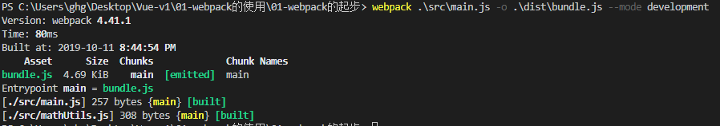

- index.html

```html
<!--
 * @Description: 
 * @version: 
 * @Author: henggao
 * @Date: 2019-10-11 19:48:48
 * @LastEditors: henggao
 * @LastEditTime: 2019-10-11 20:55:22
 -->
<!DOCTYPE html>
<html lang="en">
<head>
    <meta charset="UTF-8">
    <meta name="viewport" content="width=device-width, initial-scale=1.0">
    <meta http-equiv="X-UA-Compatible" content="ie=edge">
    <title>Document</title>
</head>
<body>

    <!-- <script src="./src/main.js"></script>
    <script src="./src/mathUtils.js"></script> -->
    <!-- 通过下面引用 -->
    <script src="./dist/bundle.js"></script>
</body>
</html>
```

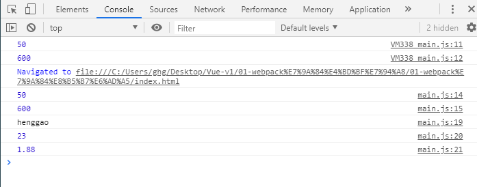

## 二、webpack的配置

1、创建webpack.config.js

```js
/*
 * @Description: 
 * @version: 
 * @Author: henggao
 * @Date: 2019-10-11 21:05:59
 * @LastEditors: henggao
 * @LastEditTime: 2019-10-11 21:27:14
 */
const path = require('path')

module.exports = {
    entry:'./src/main.js',
    output:{
        path:path.resolve(__dirname,'dist'),   //动态获取绝对路径
        filename:'bundle.js'
    }
}
```

2、初始化

```shell
npm int
```

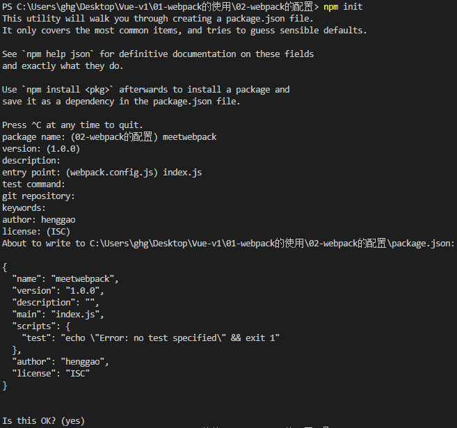

- 生成一个package.json

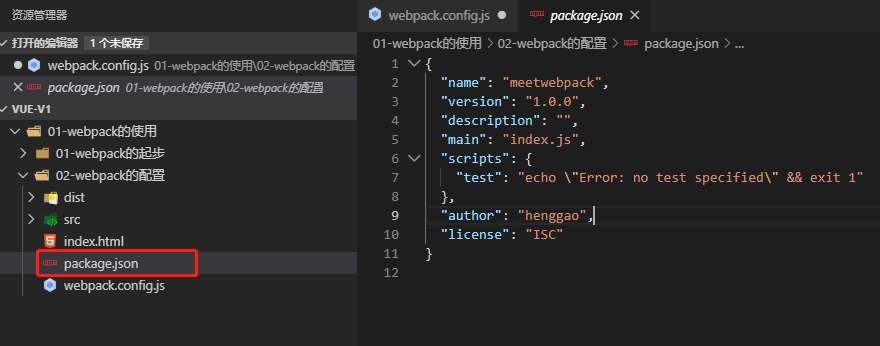

- package.json里有添加的依赖时，执行npm install，生成package-lock.json文件

  ```shell
  npm install
  ```

  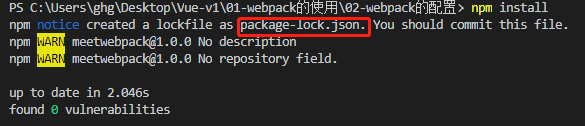

- 打包

  ```shell
  #开发模式
  webpack --mode development 
  #产品模式
  webpack --mode production
  ```

  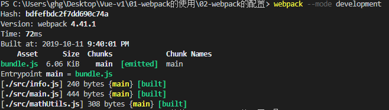

- 再做一层映射，在package.json添加信息，可以在终端使用npm run  build进行打包

  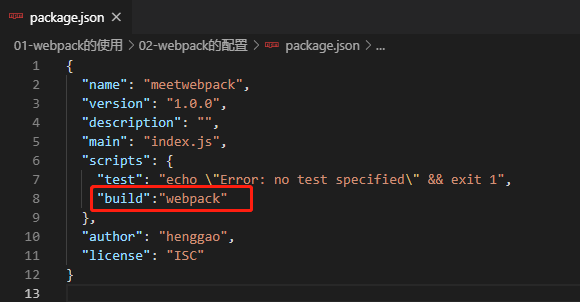

  ```shell
  npm run  build
  ```

  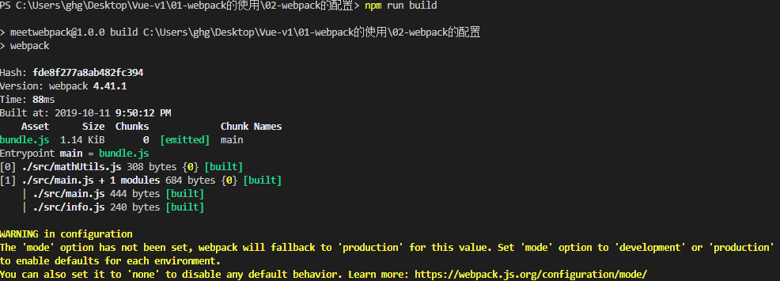

  - 优先在运行本地webpack

- 在本地安装webpack

  ```shell
  npm install webpack --save-dev
  ```

  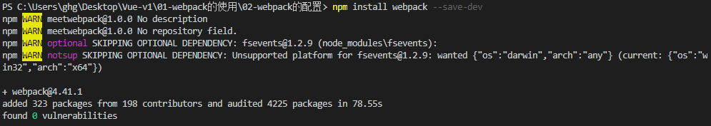

  - 重新打开package.json,多了下面部分。

    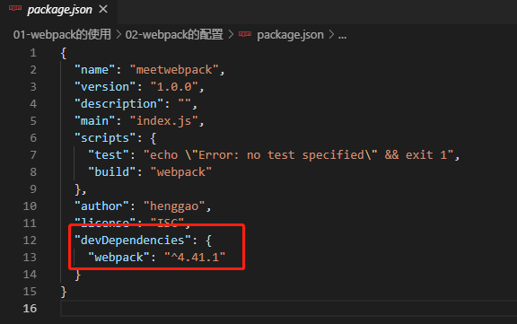

- 开发时依赖

- 运行时依赖

## 三、webpack的loader

1、创建css文件，在src/css/normal/css

- mormal.css

```css
body{
    background-color: greenyellow;
}
```

2、安装css-loader、style-loader

```shell
cnpm install --save-dev css-loader

cnpm install style-loader --save-dev
```

3、配置**webpack.config.js**

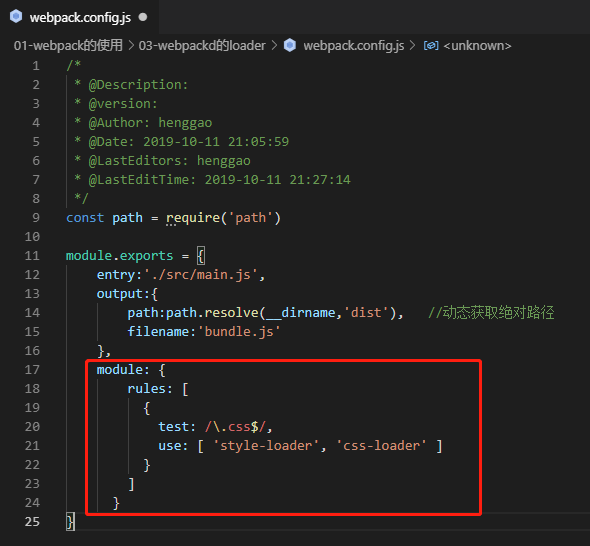

-  参考官方文档：

​	https://www.webpackjs.com/loaders/css-loader/

4、打包

```shell
npm run build
```

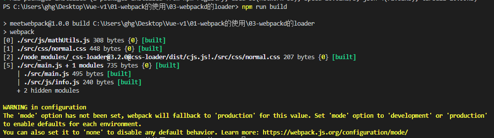

