# Vue

[TOC]

## 一、TabBar

### 1、新建项目

#### 1.1、新建tabbar

```shell
vue init webpack tabbar
```

#### 1.2、删除默认元素

- 删除components文件里的默认HelloWorld.vue

#### 1.3、修改App.vue

```vue
<template>
  <div id="app">
  </div>
</template>

<script>
export default {
  name: 'App',
  components: {
  }
}
</script>

<style>
</style>
```

#### 1.4、添加内容

- App.vue

  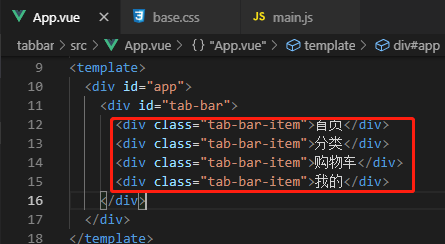

#### 1.5、引入样式

1.5.1、在src/assets创建css文件夹、img文件夹。

- 在css中创建base.css,设置一些通用样式。

  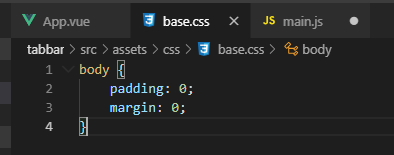

1.5.2、引用样式

- 第一种：可以在main.js中引用样式

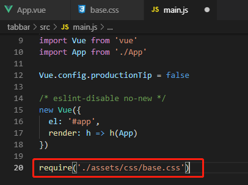

- 第二种：在App.vue中引用样式（（推荐这里引用样式））

  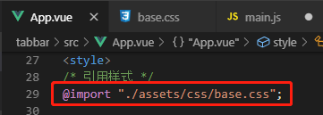

- 设置样式参数

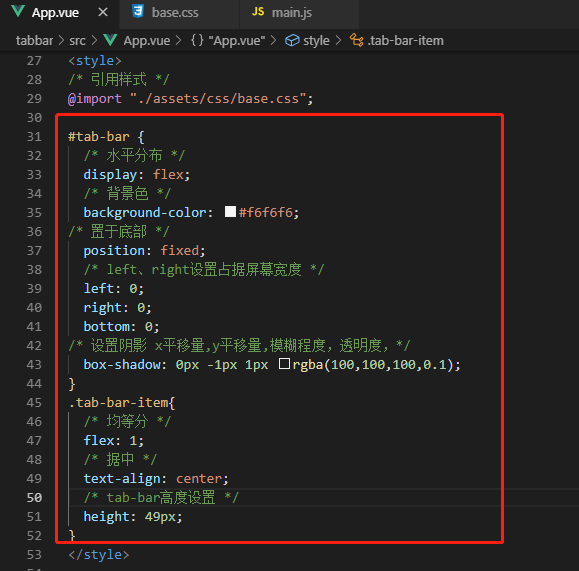


#### 1.6、Tabbar组件封装

上述1.5中这种方式没有复用性，可以封装成独立的组件。

##### 1.6.1、抽离组件

在components下新建tabbar/TabBar.vue，将App.vue中设置抽离到TabBar.vue

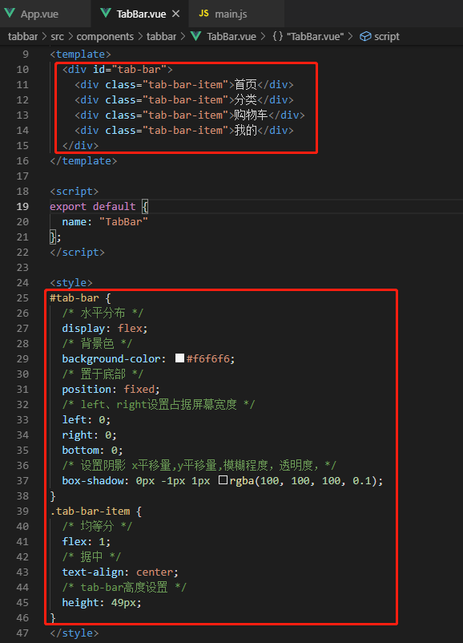

##### 1.6.2、修改App.vue

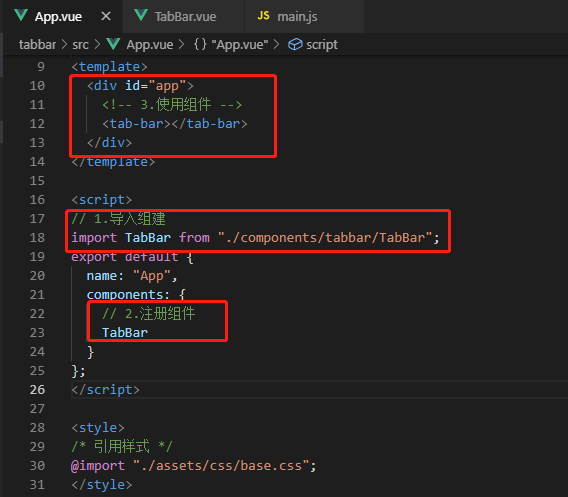

##### 1.6.3、查看

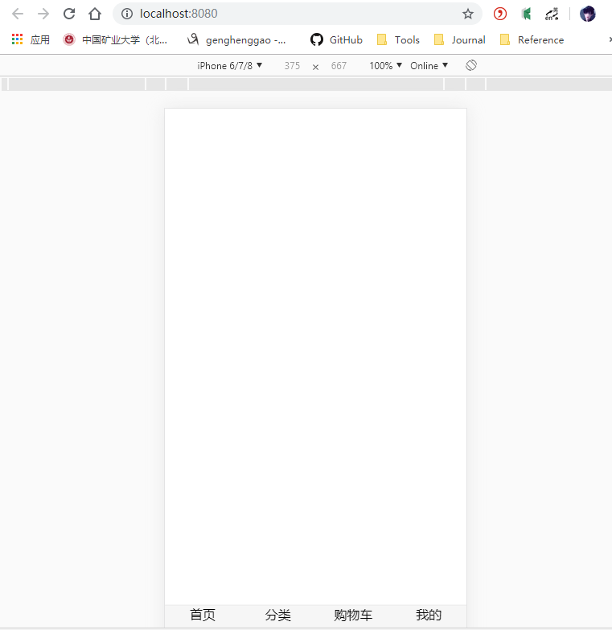

##### 1.6.4、TabBarItem组件封装

- 新建src/assets/img/tabbar,放入相应的svg图片（官方网址：http://www.iconfont.cn/ 找到需要的icon ）

- 在components/tabbar新建TabBarItem.vue

  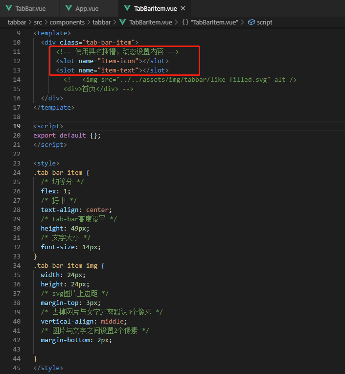

- 修改App.vue

  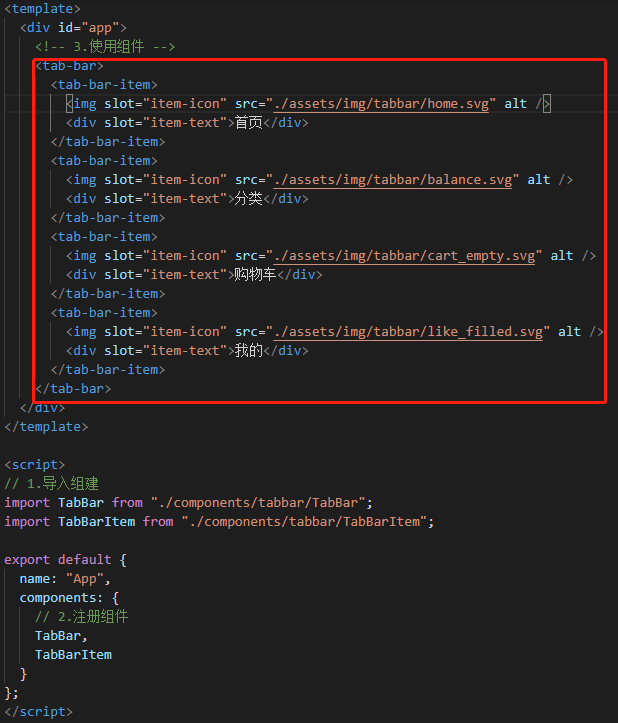

- 查看

  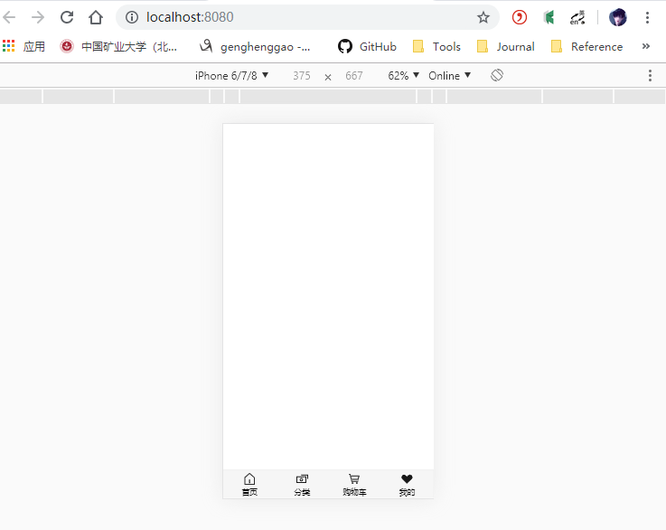

##### 1.6.5、TabBarItem传入active图片

- 设置TabBarItem.vue

  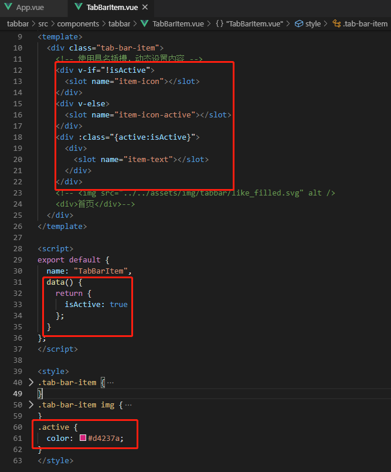

- 修改App.vue

  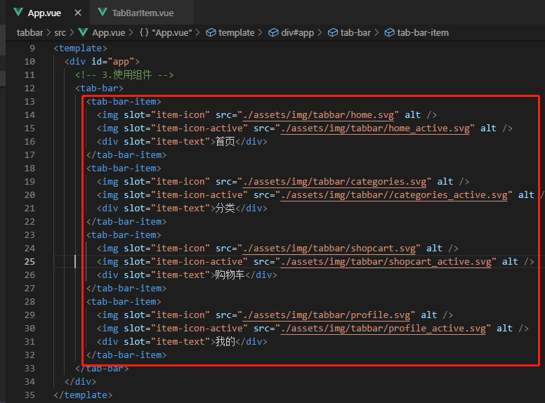

##### 1.6.6、TabBarItem和路由结合

- 手动安装router路由，创建项目时没有安装路由，手动安装。

```
 npm install vue-router --save
```

- 新建src/router/index.js

  ```js
  import Vue from 'vue'
  import VueRouter from 'vue-router'
  
  // 1、安装插件
  Vue.use(VueRouter)
  
  // 2、创建路由对象
  const routes =[
  
  ]
  
  const router = new VueRouter({
      routes
  })
  
  // 3、导出router
  export default router
  
  ```

- main.js

  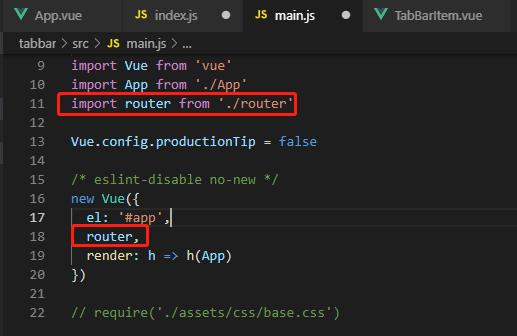

- 在src下新建views文件夹，存放视图。views下新建home、cart、category、cart等文件夹。

  - home文件下新建Home.vue

    ```vue
    <template>
      <h2>首页</h2>
    </template>
    
    <script>
    export default {
    
    }
    </script>
    
    <style>
    
    </style>
    ```

  - cart文件下新建Cart.vue

  - profile文件下新建Profile.vue

  - category文件下新建Category.vue

- 路由配置

  - index.js

  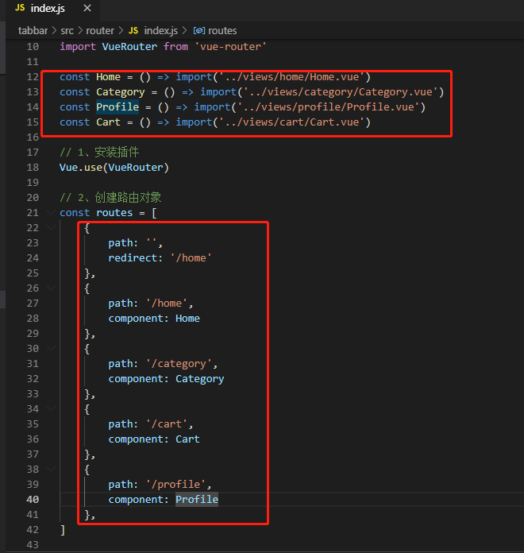

- 监听item点击，跳转

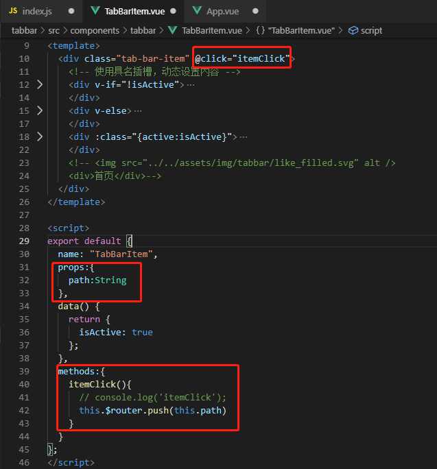

- App.vue

  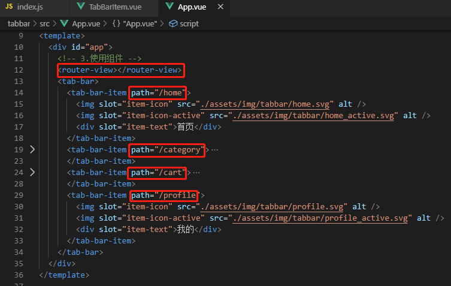

- 查看

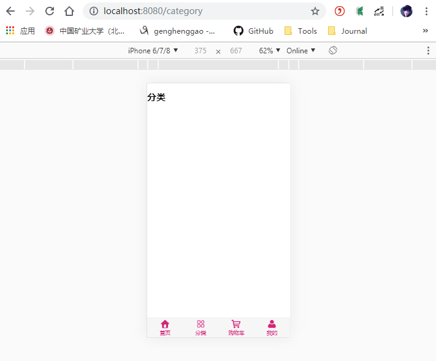

##### 1.6.7、TabBarItem和颜色动态控制

- 通过计算属性设置判断活跃状态

- TabBarItem.vue

  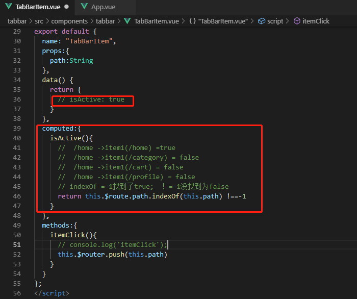

- 查看

  

- 动态决定颜色

  - 修改TabBarItem.vue

  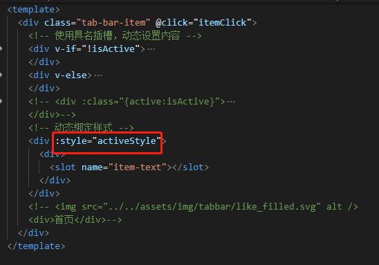

  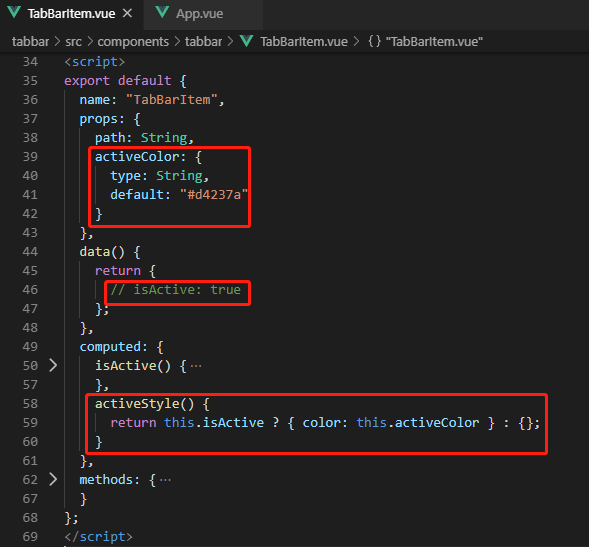

  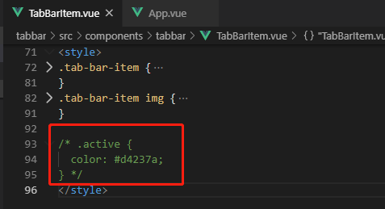

  - 完整的TabBarItem.vue

```vue
<!--
 * @Description: henggao_learning
 * @version: v1.0.0
 * @Author: henggao
 * @Date: 2019-10-18 15:52:25
 * @LastEditors: henggao
 * @LastEditTime: 2019-10-18 19:57:22
 -->
<template>
  <div class="tab-bar-item" @click="itemClick">
    <!-- 使用具名插槽，动态设置内容 -->
    <div v-if="!isActive">
      <slot name="item-icon"></slot>
    </div>
    <div v-else>
      <slot name="item-icon-active"></slot>
    </div>
    <!-- <div :class="{active:isActive}">
      <div>
        <slot name="item-text"></slot>
      </div>
    </div>-->
    <!-- 动态绑定样式 -->
    <div :style="activeStyle">
      <div>
        <slot name="item-text"></slot>
      </div>
    </div>
    <!-- 
    <div>首页</div>-->
  </div>
</template>

<script>
export default {
  name: "TabBarItem",
  props: {
    path: String,
    activeColor: {
      type: String,
      default: "#d4237a"
    }
  },
  data() {
    return {
      // isActive: true
    };
  },
  computed: {
    isActive() {
      //  /home ->item1(/home) =true
      //  /home ->item1(/category) = false
      //  /home ->item1(/cart) = false
      //  /home ->item1(/profile) = false
      // indexOf =-1找到了true;  ！=-1没找到为false
      return this.$route.path.indexOf(this.path) !== -1;
    },
    activeStyle() {
      return this.isActive ? { color: this.activeColor } : {};
    }
  },
  methods: {
    itemClick() {
      // console.log('itemClick');
      this.$router.push(this.path);
    }
  }
};
</script>

<style>
.tab-bar-item {
  /* 均等分 */
  flex: 1;
  /* 据中 */
  text-align: center;
  /* tab-bar高度设置 */
  height: 49px;
  /* 文字大小 */
  font-size: 14px;
}
.tab-bar-item img {
  width: 24px;
  height: 24px;
  /* svg图片上边距 */
  margin-top: 3px;
  /* 去掉图片与文字距离默认3个像素 */
  vertical-align: middle;
  /* 图片与文字之间设置2个像素 */
  margin-bottom: 2px;
}

/* .active {
  color: #d4237a;
} */
</style>
```

- 查看

  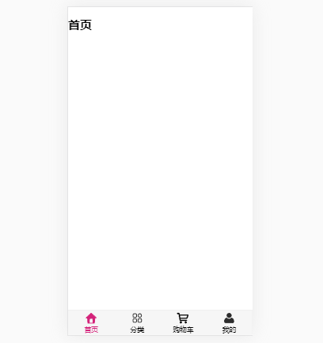

这样就封装好了，可以在App.vue中通过`activeColor`任意自定义字体颜色。

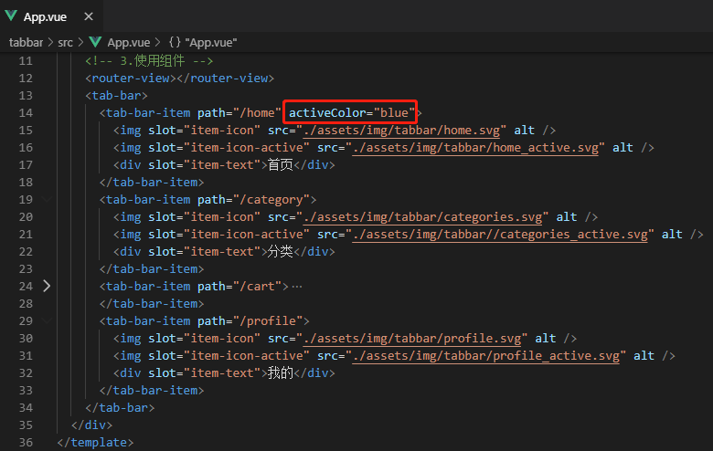

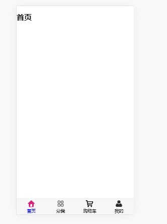

##### 1.6.8、对App.vue进行抽取

- 在components下新建MainTabBar.vue,注意一下修改对应路径

```vue
<!--
 * @Description: henggao_learning
 * @version: v1.0.0
 * @Author: henggao
 * @Date: 2019-10-18 20:12:52
 * @LastEditors: henggao
 * @LastEditTime: 2019-10-18 20:22:17
 -->
<template>
  <tab-bar>
    <tab-bar-item path="/home" activeColor="blue">
      
      
      <div slot="item-text">首页</div>
    </tab-bar-item>
    <tab-bar-item path="/category">
      
      
      <div slot="item-text">分类</div>
    </tab-bar-item>
    <tab-bar-item path="/cart">
      
      
      <div slot="item-text">购物车</div>
    </tab-bar-item>
    <tab-bar-item path="/profile">
      
      
      <div slot="item-text">我的</div>
    </tab-bar-item>
  </tab-bar>
</template>

<script>
// 1.导入组建
import TabBar from "./tabbar/TabBar";
import TabBarItem from "./tabbar/TabBarItem";
export default {
  name: "MainTabBar",
  components: {
    // 2.注册组件
    TabBar,
    TabBarItem
  }
};
</script>

<style>
</style>
```

- App.vue

  ```vue
  <!--
   * @Description: henggao_learning
   * @version: v1.0.0
   * @Author: henggao
   * @Date: 2019-10-18 14:22:29
   * @LastEditors: henggao
   * @LastEditTime: 2019-10-18 20:15:50
   -->
  <template>
    <div id="app">
      <!-- 3.使用组件 -->
      <router-view></router-view>
      <main-tab-bar></main-tab-bar>
    </div>
  </template>
  
  <script>
  import MainTabBar from "./components/MainTabBar";
  
  export default {
    name: "App",
    components: {
      MainTabBar
    }
  };
  </script>
  
  <style>
  /* 引用样式 */
  @import "./assets/css/base.css";
  </style>
  
  ```

查看即可。

