# Vue

[toc]

## 一、项目

### 1、创建项目

#### 1.1、使用Vue3创建项目

```
vue create supermall
```


### 2、使用GItHub托管

#### 2.1、新建仓库


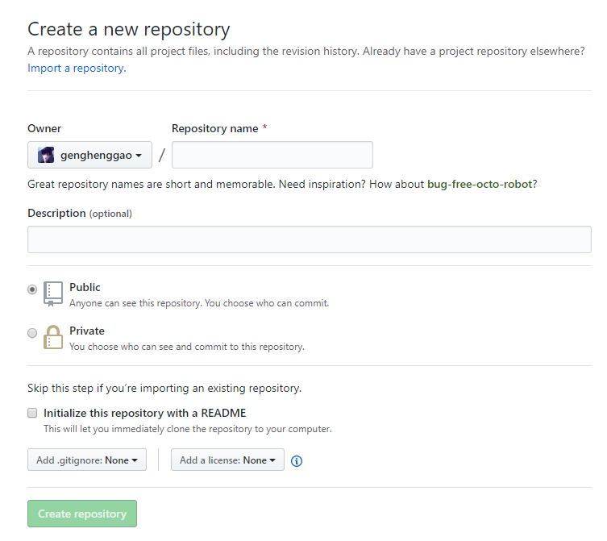

#### 2.2、关联远程仓库

```shell
git init
git remote add origin https://github.com/genghenggao/supermall.git
git push -u origin master
```

#### 2.3、查看

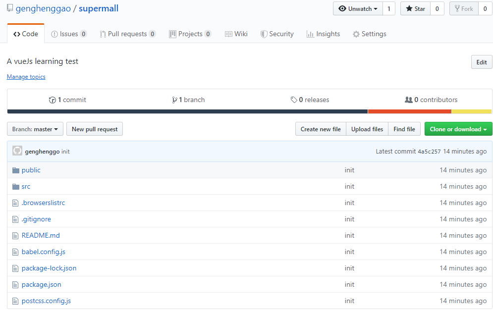

### 3、划分目录结构

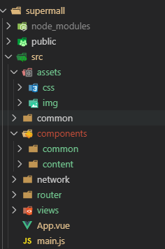

### 4、CSS文件的引入

#### 4.1、引入第三方CSS

normalize.css下载地址： https://github.com/necolas/normalize.css/tree/v2.1.3 

#### 4.2、创建自己的样式

创建自己的样式assets/css/base.css

```css
@import "./normalize.css"

/* :root ->获取根元素html */
:root {
    --color-text: #666;
    --color-hight-text: #ff577f;
    --color-tint: #ff8198;
    --color-background: #fff;
    --font-size: 14px;
    --line-height: 1.5;
}

*,
*::before,
*::after {
    margin: 0;
    padding: 0;
    box-sizing: border-box;
}

body {
    font-family: "Helvetica Neue", Arial, Helvetica, sans-serif, "PingFang SC", "Hiragino Sans GB", "Miscrosoft YaHei", "微软雅黑";
    user-select: none;
    /*禁止用户鼠标在页面上选中文字/图片等*/
    -webkit-tap-highlight-color: transparent;
    /* webkit是苹果浏览器引擎，tap点击，highlight背景高亮，color颜色，颜色用数值调节*/
    background: var(--color-background);
    color: var(--color-text);
    /* rem vw/vh */
    width: 100vw;
}

a{
    color: var(--color-text);
    text-decoration: none;
}

.clear-fix::after{
    clear: both;
    content: '';
    display: block;
    width: 0;
    height: 0;
    visibility: hidden;
}

.clear-fix{
    zoom: 1;
}

.left{
    float: left;
}
```

在App.vue中引用

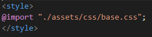

### 5、vue.config.js和editorconfig

##### 5.1、配置别名

新建src/vue.config.js（Vue3起别名方法改变，下面配置无效）

```js
module.export ={
    configureWebpack:{
        resolve:{
            alias:{
                'assets':'@/assets',
                'common':'@/common',
                'components':'@/components',
                'network':'@/network',
                'views':'@/views',
            }
        }
    }
}
```

App.vue中引用可以简写为

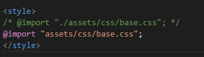

vue2中.editorconfig，vue3中没有，这是对代码的规范

```js
root = true

[*]
charset = utf-8
indent_style = space
indent_size = 2
end_of_line = lf
insert_final_newline = true
trim_trailing_whitespace = true
```

### 6、tabbar

#### 6.1、tabbar引入（一）

从06-tabbar中封装好的模块src/components/tabbar拷贝到supermall项目src/compomemts/common中

- common：放入与业务无关的模块

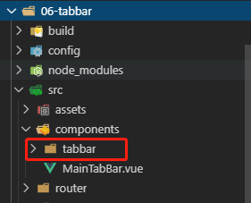

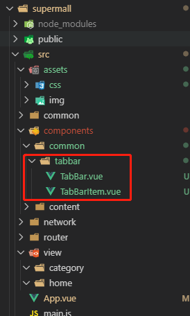

#### 6.2、tabbar引入（二）

从06-tabbar中封装好的模块src/components/MainTabBar.vue拷贝到supermall项目src/compomemts/mainTabbar/content中

- content：放入与业务有关的模块

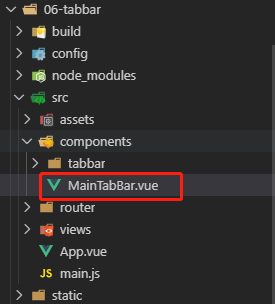


#### 6.3、图片资源

从06-tabbar中封装好的模块src/assets/img拷贝到supermall项目src/assets/img中

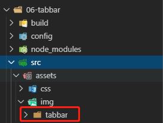

#### 6.4、修改路径

使用别名，修改对应文件引用路径

- MainTabBar.vue

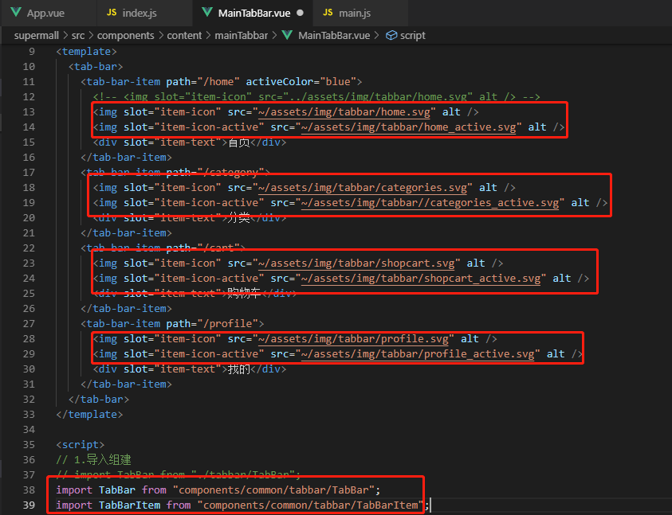

- 按下面这种配置

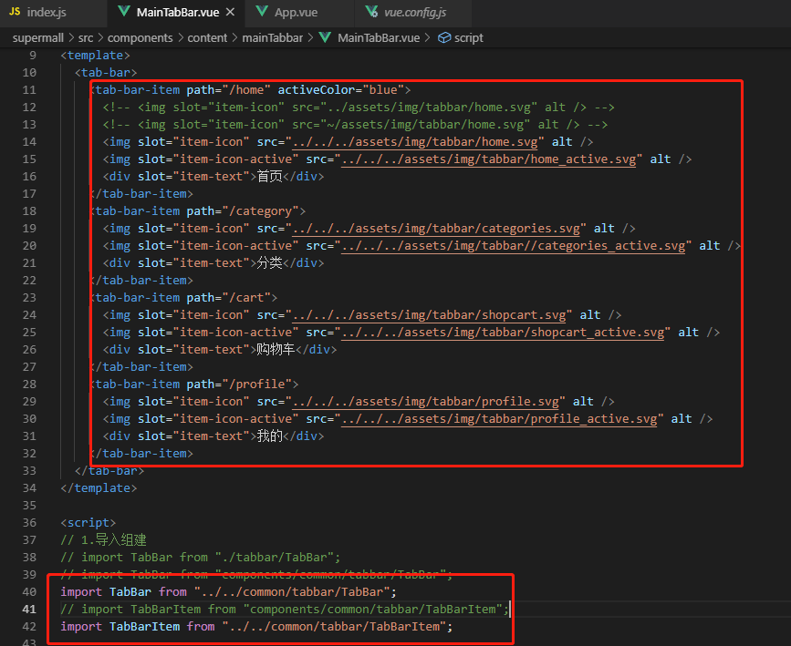

#### 6.5、安装router路由

```shell
npm install vue-router --save
```

从06-tabbar中封装好的模块src/router/index.js拷贝到supermall项目src/router中

- src/router/index.js

```js
/*
 * @Description: henggao_learning
 * @version: v1.0.0
 * @Author: henggao
 * @Date: 2019-10-22 20:17:01
 * @LastEditors: henggao
 * @LastEditTime: 2019-10-22 20:39:18
 */
import Vue from 'vue'
import VueRouter from 'vue-router'

// 导入，懒加载
const Home = () => import('@/views/home/Home.vue')
const Category = () => import('@/views/category/Category.vue')
const Profile = () => import('@/views/profile/Profile.vue')
const Cart = () => import('@/views/cart/Cart.vue')

// 1、安装插件
Vue.use(VueRouter)

// 2、创建路由对象
const routes = [
    {
        path: '',
        redirect: '/home'
    },
    {
        path: '/home',
        component: Home
    },
    {
        path: '/category',
        component: Category
    },
    {
        path: '/cart',
        component: Cart
    },
    {
        path: '/profile',
        component: Profile
    },
]

const router = new VueRouter({
    routes,
    // hash模式# ，使用history模式
    mode:'history'
})

// 3、导出router
export default router

```

mian.js挂载

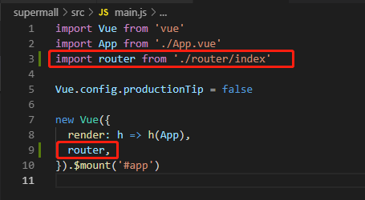

从06-tabbar中封装好的模块src/views中的文件拷贝到supermall项目src/views中

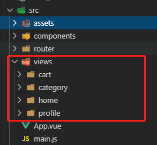

#### 6.6、App.vue

```vue
<!--
 * @Description: henggao_learning
 * @version: v1.0.0
 * @Author: henggao
 * @Date: 2019-10-22 18:17:06
 * @LastEditors: henggao
 * @LastEditTime: 2019-10-22 21:00:04
 -->
<template>
  <div id="app">
    <router-view></router-view>
    <main-tab-bar></main-tab-bar>
  </div>
</template>

<script>
// import MainTabBar from 'components/content/mainTabbar/MainTabBar'
import MainTabBar from './components/content/mainTabbar/MainTabBar'
export default {
  name: "app",
  components: {
    MainTabBar
  }
};
</script>

<style>
/* @import "./assets/css/base.css"; */
@import "assets/css/base.css";
</style>

```

#### 6.7、运行查看

```shell
npm run serve
```

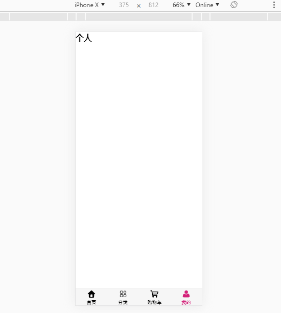