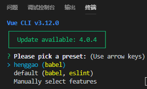
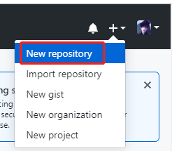
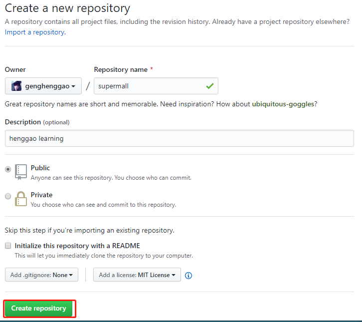

# Vue

[toc]

## 一、项目

### 1、创建项目

#### 1.1、使用Vue3创建项目

```
vue create supermall
```



### 2、使用GItHub托管

#### 2.1、新建仓库





#### 2.2、

```shell
git remote add origin https://github.com/genghenggao/supermall.git

 git push -u origin master
```

